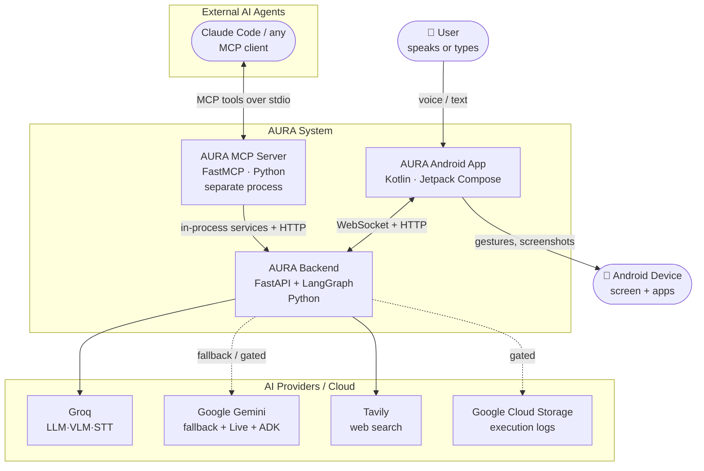
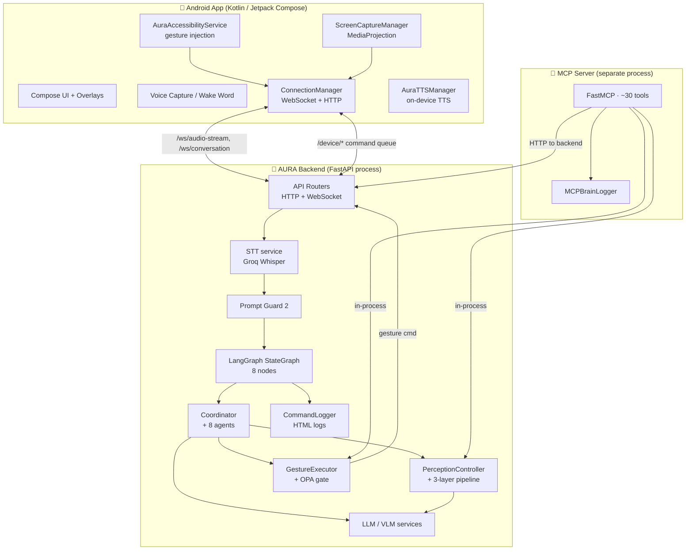
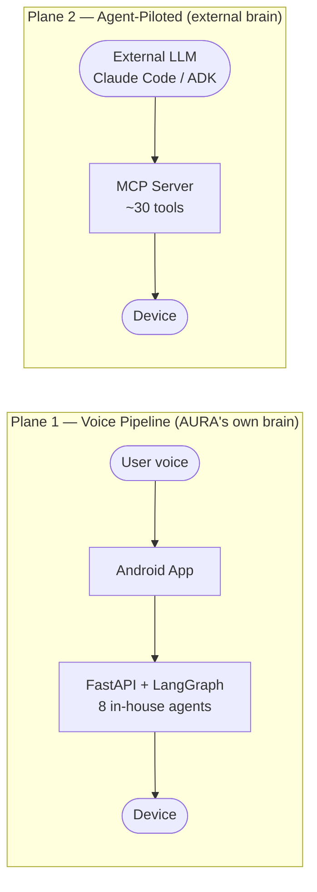
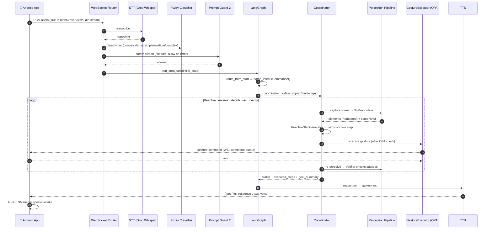
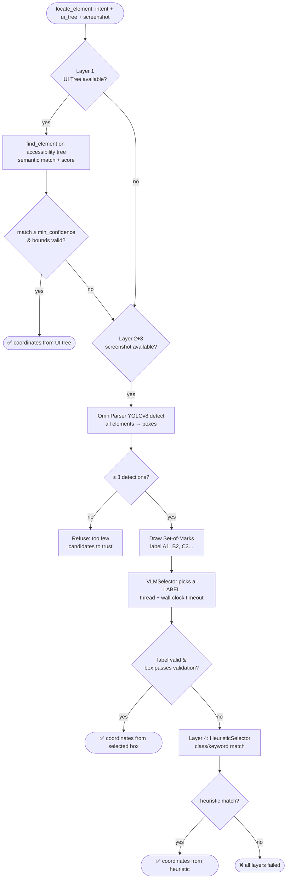
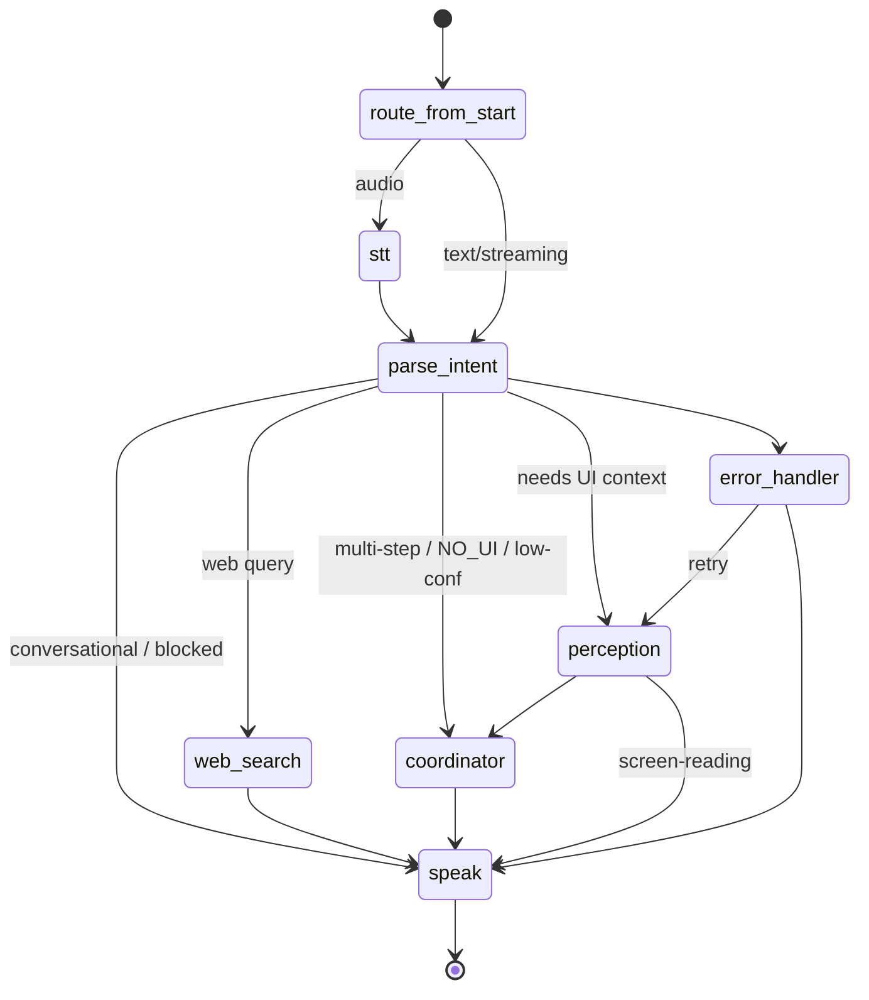
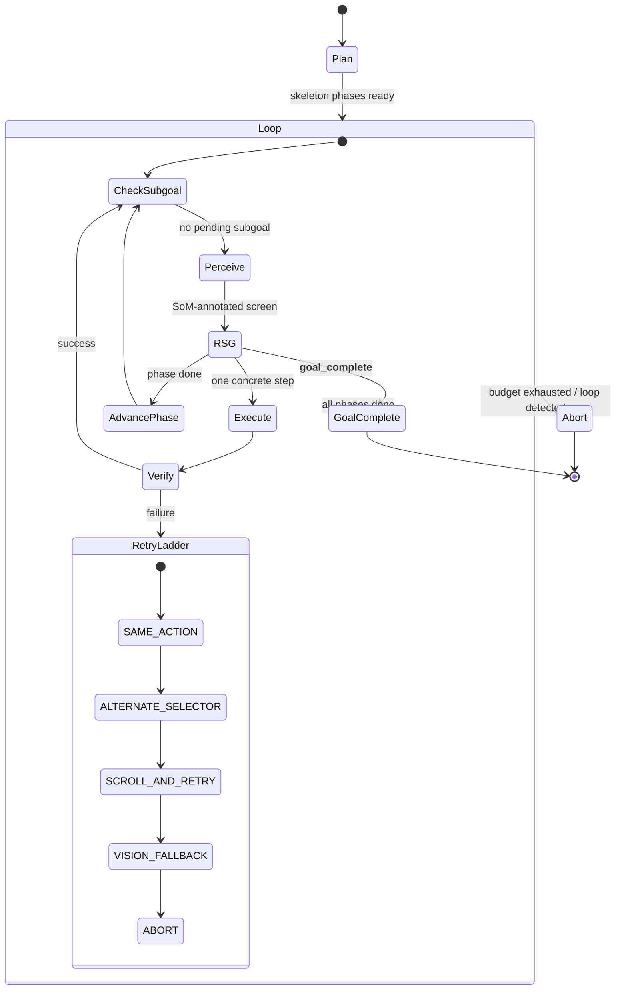
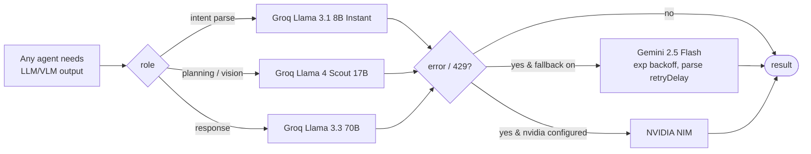

# AURA — Technical Design Document

> **Document type.** This is a **Technical Design Document (TDD)**, also called a **Software Architecture Document (SAD)**. It is structured along the **arc42** template (the de-facto standard for documenting an *existing* system) and uses the **C4 model** (Context → Container → Component) for its diagrams. The formal IEEE equivalent is **IEEE 1016 (Software Design Description)**. Its purpose is to be the single, code-grounded reference for the system: what was built, *why* it was built that way (including alternatives that were rejected), and how every major subsystem works.
>
> **Accuracy contract.** Every claim here was verified against source on the `feature/mcp-server` branch. Where a number originates from a code comment rather than a measured benchmark, it is explicitly labelled a **design target**. Subsystems are tagged by activation status (**Active / Feature-gated / Partial**) so nothing is overstated.

**Last derived from source:** 2026-06-04 · **Branch:** `feature/mcp-server`

---

## Table of Contents

1. [Introduction & Goals](#1-introduction--goals)
2. [System at a Glance (C4 Level 1 — Context)](#2-system-at-a-glance-c4-level-1--context)
3. [Subsystem Activation Status](#3-subsystem-activation-status)
4. [Container Architecture (C4 Level 2)](#4-container-architecture-c4-level-2)
5. [The Two Control Planes](#5-the-two-control-planes)
6. [Request Lifecycle (Voice/Text Path)](#6-request-lifecycle-voicetext-path)
7. [Subsystem: Perception Pipeline (the SoM core)](#7-subsystem-perception-pipeline-the-set-of-marks-core)
8. [Subsystem: LangGraph Orchestration](#8-subsystem-langgraph-orchestration)
9. [Subsystem: The Coordinator & Hybrid Planner](#9-subsystem-the-coordinator--hybrid-planner)
10. [Subsystem: Tri-Provider Model Routing](#10-subsystem-tri-provider-model-routing)
11. [Subsystem: Safety (OPA + Prompt Guard)](#11-subsystem-safety-opa--prompt-guard)
12. [Subsystem: MCP Server (Agent-Piloted Mode)](#12-subsystem-mcp-server-agent-piloted-mode)
13. [Subsystem: Android Companion App](#13-subsystem-android-companion-app)
14. [Subsystem: Google Cloud / ADK / Gemini Live](#14-subsystem-google-cloud--adk--gemini-live)
15. [Subsystem: Reliability Engine (Reflexion, Retry, Loop Detection)](#15-subsystem-reliability-engine)
16. [State Model & Data Flow](#16-state-model--data-flow)
17. [Observability & Logging](#17-observability--logging)
18. [Technology Stack (with versions & rationale)](#18-technology-stack)
19. [Design Decisions & Trade-offs (capstone)](#19-design-decisions--trade-offs)
20. [Deployment](#20-deployment)
21. [Appendix A: Résumé / Interview Talking Points](#appendix-a-résumé--interview-talking-points)
22. [Appendix B: Glossary](#appendix-b-glossary)

---

## 1. Introduction & Goals

### 1.1 What AURA is

**AURA (Autonomous User-Responsive Agent)** is a production-grade **Android UI-automation system driven by natural language**. A user speaks or types a command — *"Open Spotify and play my liked songs"* — and AURA perceives the live phone screen, plans a sequence of UI steps, executes real gestures (tap, swipe, type, scroll) on the device, verifies the outcome after each step, and replies in natural language.

It is not scripted automation (no fixed macros, no per-app selectors maintained by hand). It is **closed-loop, perception-driven control**: the system looks at whatever is actually on screen, decides the next action, acts, then looks again.

### 1.2 The core technical problem and the central design bet

The hardest sub-problem in any "LLM controls a screen" system is **grounding**: turning a semantic intent ("the play button") into a precise `(x, y)` pixel to tap. Vision-Language Models (VLMs) are excellent at *understanding* a screen but notoriously bad at *emitting accurate coordinates* — they hallucinate pixels.

AURA's central architectural bet, enforced as an invariant throughout the codebase, is **Set-of-Marks (SoM)**:

> **The VLM never produces coordinates. It only selects among numbered candidate elements that were detected deterministically.** Coordinates always come from a trustworthy source (the Android accessibility tree, or a YOLOv8 computer-vision detector) — never from the language model's imagination.

Everything else in the architecture (the three-layer perception pipeline, the validation guards, the retry ladder) exists to make that bet hold under real-world conditions.

### 1.3 Quality goals (priority order)

| Priority | Quality goal | How it shows up in the architecture |
|---|---|---|
| 1 | **Correctness of grounding** | Set-of-Marks invariant; coordinate-bounds & box-size validation; "minimum-3-detections" guard |
| 2 | **Reliability under failure** | Per-subgoal 5-stage retry ladder; loop detection; action budgets; Reflexion lessons; hard timeouts |
| 3 | **Low latency** | Groq as primary provider (high tokens/sec); UI-tree-first perception; on-device TTS; perception caching |
| 4 | **Safety** | OPA Rego policy gate on every gesture; Llama Prompt Guard 2 on every input; fail-safe semantics |
| 5 | **Extensibility / portability** | Single-responsibility agents; tri-provider abstraction; MCP server exposing the device to *any* agent |

---

## 2. System at a Glance (C4 Level 1 — Context)



**Key actors:**

- **The user** drives AURA through the Android app (voice or text).
- **An external AI agent** (e.g. Claude Code) can *also* drive the same device through the **MCP server** — this is "agent-piloted mode" and is a distinct control plane (see §5 and §12).
- **The Android device** is both the input surface (microphone, screen) and the execution target.
- **AI providers** are accessed only through unified service wrappers; the system is provider-pluggable.

---

## 3. Subsystem Activation Status

This table is the honesty backbone of the document. "Default" means behaviour with the shipped defaults in `config/settings.py` and no extra environment configuration.

| Subsystem | Status (default) | Controlling flag / fact | Notes |
|---|---|---|---|
| Voice/Text → LangGraph pipeline | **Active** | — | The primary path; always on |
| 3-layer perception (UI tree → CV → VLM) | **Active** | — | Core of the system |
| Coordinator hybrid planner + retry ladder | **Active** | — | Drives every multi-step task |
| Tri-provider LLM/VLM routing | **Active** | `default_llm_provider="groq"` | Groq primary, Gemini fallback |
| Default VLM provider | **Groq (not Gemini)** | `default_vlm_provider="groq"` | Gemini-first is *configurable* but **not the default**, despite some docstrings/checklists implying otherwise |
| OPA policy gate + Prompt Guard | **Active** | `safety_model` set | Fail-safe: allow on engine error |
| MCP server (`aura_mcp_server.py`) | **Active (separate process)** | `mcp_enabled=True` | Run via `python aura_mcp_server.py`; not auto-started by `main.py` |
| ADK root agent (`adk_agent.py`) | **Active (best-effort)** | import-guarded | Registered in lifespan if `google-adk` is importable (it is in `requirements.txt`); silently skipped otherwise |
| Gemini Live bidi `/ws/live` | **Feature-gated (OFF)** | `gemini_live_enabled=False` | Endpoint only registered when `true` |
| GCS execution-log upload | **Feature-gated (OFF)** | `gcs_logs_enabled=False` | Non-fatal even when on |
| `AuraQueryEngine` streaming layer | **Feature-gated (OFF)** | `query_engine_enabled=False` | Legacy direct-node invocation otherwise |
| Vertex AI routing | **Feature-gated (OFF)** | `use_vertex_ai=False` | Optional second GCP service |
| Cloud Run deployment | **Not claimed** | — | `Dockerfile` exists; a live deployment is *not* asserted by this doc |
| Android-embedded MCP server | **Not in this repo** | — | Lives in a separate worktree; deliberately not documented here |

> **Interview-safe phrasing:** "The Gemini-Live and Cloud-logging integrations are built and feature-gated behind flags; the default runtime uses Groq for speed with Gemini as automatic fallback."

---

## 4. Container Architecture (C4 Level 2)



**Containers (independently runnable units):**

1. **AURA Backend** (`main.py`) — a FastAPI app hosting the HTTP/WebSocket API, the LangGraph state machine, all agents, the perception pipeline, the gesture executor, and the model services. This is the brain for the voice/text plane.
2. **AURA MCP Server** (`aura_mcp_server.py`) — a standalone FastMCP process that exposes device control as MCP tools to external agents. It reuses the backend's in-process services *and* calls some backend HTTP endpoints.
3. **AURA Android App** (`UI/`) — a single-module Kotlin/Compose app that captures voice, renders UI/overlays, and — critically — is the only component that physically touches the device (gestures via AccessibilityService, screenshots via MediaProjection).

---

## 5. The Two Control Planes

A defining feature of AURA is that **the same device can be driven by two different "brains"**, through two architecturally distinct planes.



| Dimension | Plane 1 — Voice Pipeline | Plane 2 — Agent-Piloted (MCP) |
|---|---|---|
| Who decides the next action? | AURA's own LangGraph + Coordinator | The external LLM (e.g. Claude) |
| Entry point | `/ws/audio-stream`, `/ws/conversation` | MCP `stdio` tools |
| Planning | Skeleton phases + reactive step generation | The external model plans freely |
| Perception | `PerceptionController` (auto) | Explicit tools (`perceive_screen`, `get_ui_tree`, …) |
| Safety | OPA gate inside `GestureExecutor` | `validate_action()` tool **plus** the same OPA gate inside the actor |
| Use case | End-user product | Power users / developers / Claude-driven automation; also the eligibility hook for agent frameworks |

**Why both exist.** Plane 1 is the product. Plane 2 turns AURA into *infrastructure*: any MCP-capable agent gets a clean, documented, safety-gated API to a real Android phone. The two planes share the same low-level execution machinery (`ActorAgent`, `GestureExecutor`, `PerceptionController`), so there is one source of truth for "how a tap actually happens."

---

## 6. Request Lifecycle (Voice/Text Path)



**Stage-by-stage (with the real files):**

1. **Transport in** — Android streams PCM audio over a WebSocket (`api_handlers/websocket_router.py`, `api/websocket.py`: `/ws/audio-stream`, `/ws/audio-stream-final`, `/ws/conversation`).
2. **STT** — `services/stt.py` uses **Groq Whisper Large v3 Turbo**.
3. **Intent tiering** — `utils/fuzzy_classifier.py` classifies into a complexity tier; rule-based first, LLM fallback.
4. **Safety** — `services/prompt_guard.py` (Llama Prompt Guard 2) screens the text. **Fail-safe:** if the guard API errors, the request is *allowed* rather than blocked, so safety never becomes an availability outage.
5. **Graph dispatch** — `aura_graph/graph.py::run_aura_task()` invokes the compiled LangGraph with a hard `graph_timeout_seconds` (default **120 s**) and `recursion_limit` (default **100**).
6. **Routing** — `aura_graph/edges.py` routes the intent: conversational → `speak`; web-search → `web_search`; simple device action → `coordinator`; complex/multi-step ("and"/"then") → `coordinator`; UI actions needing coordinates → `perception` first.
7. **Execution** — the **Coordinator** runs the perceive→decide→act→verify loop (§9).
8. **Response** — `agents/responder.py` produces natural language; `services/tts.py` returns it either as an **on-device TTS payload** (default, ~0 ms server cost) or server-side **Edge-TTS** WAV (legacy).

---

## 7. Subsystem: Perception Pipeline (the Set-of-Marks core)

> Files: `perception/perception_pipeline.py`, `perception/omniparser_detector.py`, `perception/vlm_selector.py`, `services/perception_controller.py`, `utils/ui_element_finder.py`

### 7.1 What it is

A **three-layer hybrid** that converts "the user wants the play button" into a validated `(x, y)` coordinate, trying the cheapest/most-reliable source first and escalating only when needed.



### 7.2 Why this approach (and what was rejected)

- **Rejected: let the VLM output coordinates.** This is the obvious approach and the one that fails in practice — VLMs hallucinate pixels, especially on dense native Android UIs. Set-of-Marks reframes the task from *generation* (hard) to *classification among valid options* (easy and verifiable).
- **Rejected: UI-tree-only.** The Android accessibility tree is fast and pixel-perfect but **empty or misleading** for WebView, Canvas, games, and media players. ~20–30% of real screens need vision.
- **Rejected: CV-only.** YOLOv8 finds boxes but has no semantics — it can't tell "the Like button" from "the Share button."
- **Chosen: layered hybrid.** Layer 1 (UI tree) handles the common, cheap case; Layers 2+3 (CV + VLM-SoM) handle the visual case; Layer 4 (heuristic) is a no-API last resort. Each layer's output is validated before it's trusted.

### 7.3 How it works (key mechanics)

- **Layer 1 — UI Tree** (`_try_ui_tree`): `find_element()` does fuzzy semantic matching over accessibility nodes, returns a score, and the result must clear `min_confidence` (default 0.70) and `validate_coordinates()` (on-screen bounds).
- **Layer 2 — CV detection** (`OmniParserDetector`, YOLOv8 via `ultralytics`): produces `Detection` objects `{id: "A", class_name, box, center, confidence}`. The model is lazy-loaded and **warmed up in a background thread at graph compile time** so the first real call bears no model-load latency.
- **The "minimum 3 detections" guard:** if YOLO returns fewer than 3 candidates, the pipeline *refuses* to call the VLM and returns a clean "not found" — because forcing a selection from an incomplete candidate set reliably produces a *wrong tap*. Refusing is safer than guessing.
- **Layer 3 — VLM selection** (`VLMSelector`): the annotated (Set-of-Marks) screenshot plus a text list of labelled regions goes to the VLM, which returns JSON `{thinking, label, description}`. The selector parses the label, maps it back to the detection, and returns *that detection's* center. It runs inside a `ThreadPoolExecutor` with a **hard wall-clock timeout** (`vlm_timeout_seconds`, default 30 s) so a slow provider can't stall the loop. A two-prompt fallback (`select_with_fallback`) retries with a more detailed prompt if the first attempt yields no match.
- **Layer 4 — Heuristic** (`HeuristicSelector`): pure class-name/keyword matching, no API call — used only when the VLM is unavailable or failed.
- **Validation at every exit:** bounds check, box-size minimum (`min_box_size`), and confidence thresholds. A coordinate is never returned without passing these.

### 7.4 Trade-offs / limits

- **Latency design targets (from code comments, not measured):** UI tree ~10–50 ms; CV ~200–400 ms GPU / 2–3 s CPU; VLM ~300–600 ms API. Treat these as targets.
- **WebView dependence on CV** means perception quality on canvas-heavy apps is bounded by YOLOv8 recall.
- The pipeline caches detections (`perception_cache_ttl`, default 2 s) to avoid redundant captures across rapid steps.

---

## 8. Subsystem: LangGraph Orchestration

> Files: `aura_graph/graph.py`, `aura_graph/state.py`, `aura_graph/edges.py`, `aura_graph/core_nodes.py`, `aura_graph/nodes/`

### 8.1 What it is

A **`StateGraph`** (LangGraph 1.0) state machine that drives one user command from raw input to spoken response. Nodes are processing stages; conditional edges encode routing decisions; a shared `TaskState` accumulates everything.



### 8.2 Why LangGraph (and what was rejected)

- **Rejected: a hand-rolled async orchestrator.** Possible, but loses checkpointing, streaming, and a declarative routing model — all of which AURA needs.
- **Rejected: a linear chain (LangChain LCEL).** A device-automation task is inherently *cyclic* (perceive→act→verify→re-perceive). Chains don't express loops and conditional re-entry cleanly.
- **Chosen: LangGraph.** It gives a typed shared state (`TaskState`), conditional edges, a checkpointer for per-conversation memory, native streaming for live progress, and built-in recursion limits — exactly the primitives an agentic loop needs.

### 8.3 How it works

- **`TaskState`** is a `TypedDict` (~60 fields) passed between nodes. Concurrent writes are merged by **custom reducers** (see §16): last-writer-wins for `status`, first-writer-wins for `end_time`, append-with-cap for `executed_steps`.
- **Compilation** (`compile_aura_graph`) wires services and all agents once at startup, attaches a `MemorySaver` checkpointer (per-`thread_id` conversation memory) and an `InMemoryStore` (cross-task facts), warms up YOLO, and registers agents in an `AgentRegistry`.
- **Entry points:** `execute_aura_task_from_streaming` (WebSocket), `execute_aura_task_from_text` (text / ADK), `execute_aura_task` (raw audio). All share `_finalize_and_upload()` for logging + (gated) GCS upload.
- **Guards:** `graph_recursion_limit` (100 = 4 nodes/step × 10 steps × 2.5 buffer) and `graph_timeout_seconds` (120) prevent runaway or hung tasks.

---

## 9. Subsystem: The Coordinator & Hybrid Planner

> Files: `agents/coordinator.py` (~2,600 lines — the most complex unit), `agents/planner_agent.py`, `services/reactive_step_generator.py`, `services/goal_decomposer.py`

### 9.1 What it is

The Coordinator is the agent that actually *runs* a multi-step task. It implements a **hybrid two-layer planner**:

1. **Skeleton planning (upfront, coarse):** `PlannerAgent` decomposes the goal into a small set of **phases** (e.g. *Phase 1: open Spotify · Phase 2: navigate to Liked Songs · Phase 3: play*). It does **not** commit to concrete taps.
2. **Reactive step generation (per-screen, fine):** at each loop iteration, the `ReactiveStepGenerator` (RSG) looks at the *live* screen and produces exactly **one** concrete next action grounded in what's actually visible.



### 9.2 Why hybrid planning (and what was rejected)

- **Rejected: full upfront planning.** Committing to a concrete tap sequence before seeing each screen is brittle — the plan is stale the moment the first screen differs from expectation (ads, dialogs, A/B layouts).
- **Rejected: pure reactive (no plan).** Without a skeleton, the agent loses the thread of the overall goal and wanders.
- **Chosen: skeleton + reactive.** The skeleton preserves *direction*; the per-screen RSG preserves *grounding*. This is the key reliability idea — the plan says "where," the live screen says "how."

### 9.3 How it works (the RSG ↔ Coordinator contract)

The RSG returns a `Subgoal`; control signals are passed back through `Subgoal.parameters` keys the Coordinator reads each iteration:

| Signal key | Meaning / Coordinator reaction |
|---|---|
| `__goal_complete__` | Goal achieved → mark complete, break loop |
| `__phase_complete__` | This step finishes the phase → advance to next phase after executing |
| `__screen_context__` | RSG's own description of the current screen → fed forward as `running_screen_context` |
| `__agent_memory__` | Cross-turn scratchpad the VLM maintains → fed back into the next RSG call |
| `__prev_step_ok__` / `__prev_step_issue__` | RSG's self-diagnosis of the previous step → retroactively patches `step_memory` so future steps see "issue_detected" |

Additional mechanics worth knowing:

- **`open_app` short-circuit:** when a phase is literally `Open <App>`, the Coordinator skips the VLM entirely and launches by package name (via the app inventory) — avoiding a hallucinated tap on the wrong icon. It also checks whether the target app is *already* foreground and skips redundant launches.
- **SoM annotation for the RSG:** before each RSG call, the Coordinator captures a fresh screenshot, builds the labelled (Set-of-Marks) image, and — when the UI tree is empty (e.g. Google Maps `SurfaceView`) — falls back to OmniParser CV detections so the RSG still gets numbered badges.
- **Context-window guards:** `step_memory` is trimmed to `MAX_STEP_MEMORY`; `executed_steps` is capped at 50 (a custom LangGraph reducer); the step-history window is configurable (`step_history_window`, default 6 — recent steps shown in full, older summarized).
- **Web "how-to" hints:** before planning, the Coordinator optionally fetches an official how-to guide via Tavily (5 s timeout, non-fatal) and injects it as planning context.

### 9.4 The 8 single-responsibility agents

Strict single-responsibility is a maintained invariant (no merging, no scope creep):

| Agent | File | Responsibility | LLM calls? |
|---|---|---|---|
| Perceiver | `agents/perceiver_agent.py` | Wraps `PerceptionController`, returns screen state | via VLM |
| Commander | `agents/commander.py` | Parse utterance → structured intent | yes (fast) |
| Planner | `agents/planner_agent.py` | Goal → skeleton phases | yes (planning) |
| Coordinator | `agents/coordinator.py` | The perceive→decide→act→verify loop | orchestrates |
| Actor | `agents/actor_agent.py` | Execute one gesture | **zero** (deterministic) |
| Responder | `agents/responder.py` | Natural-language reply | yes (fast) |
| Validator | `agents/validator.py` | Rule-based pre-execution checks | no |
| Verifier | `agents/verifier_agent.py` | Post-action success verification | yes (minimal) |

---

## 10. Subsystem: Tri-Provider Model Routing

> Files: `services/llm.py`, `services/vlm.py`, `services/nvidia_nim.py`, `config/settings.py`, `config/model_router.py`

### 10.1 What it is

A unified abstraction over **Groq (primary), Google Gemini (fallback), and NVIDIA NIM (optional)** for every LLM/VLM call. No module ever calls a provider SDK directly — all traffic goes through `LLMService` / `VLMService`.



### 10.2 Why tri-provider (and what was rejected)

- **Rejected: single provider.** A single provider is a single point of failure for both *availability* (rate limits, outages) and *cost/latency* optimization.
- **Chosen: provider-by-role + automatic fallback.** Groq is the default because of its very high tokens/sec (low latency for an interactive voice agent). Gemini is the resilient fallback (and the strategic provider for the hackathon — first-class support exists, configurable as primary). NVIDIA NIM is an optional third path.

### 10.3 How it works

- **Role-based model selection** (`config/settings.py`): intent parsing → `llama-3.1-8b-instant`; planning/vision → `meta-llama/llama-4-scout-17b-16e-instruct`; response → `llama-3.3-70b-versatile`; safety → `meta-llama/llama-prompt-guard-2-86m`.
- **Lazy client init:** Gemini/NVIDIA clients are only constructed if they could be used (configured as primary/fallback and key present).
- **429/backoff handling:** both `llm.py` and `vlm.py` parse Gemini's server-specified `retryDelay` from 429 errors and apply bounded exponential backoff (`_GEMINI_MAX_RETRIES=3`, base 2 s, max 60 s).
- **Token budgeting:** all calls flow through `utils/token_tracker.py`, which tags the calling agent (`caller_agent`) and enforces per-task budget caps.

### 10.4 Trade-offs

- Groq model availability drives the default model list; provider-specific quirks (JSON reliability) are why the Commander uses a 70B model (`commander_model`) rather than the 8B default for structured output.

---

## 11. Subsystem: Safety (OPA + Prompt Guard)

> Files: `services/policy_engine.py`, `policies/`, `policies/sensitive_actions.py`, `services/prompt_guard.py`, `services/gesture_executor.py`

### 11.1 What it is

Two independent safety layers:

1. **Input screening** — `PromptGuard` (Llama Prompt Guard 2, 86M) screens every user utterance for jailbreak/prompt-injection before it reaches planning.
2. **Action gating** — an **Open Policy Agent (OPA) Rego** policy is evaluated for **every gesture** in `GestureExecutor` before it executes; sensitive/irreversible actions (send, purchase, delete, post) can be blocked or flagged as `requires_confirmation`.

### 11.2 Why this design

- **Defense in depth:** screening the *input* catches malicious prompts; gating the *output action* catches dangerous behaviour regardless of how it was reached (including via the MCP plane).
- **Policy-as-code (OPA/Rego):** safety rules live in declarative policy files, not scattered `if` statements — auditable, testable, and changeable without touching execution code.
- **Fail-safe semantics:** both layers **allow on engine error**. This is a deliberate availability choice — a safety dependency outage degrades to "permissive" rather than bricking the assistant. (A higher-security deployment would invert this to fail-closed.)

### 11.3 How it works

- The MCP plane additionally exposes `validate_action()` so an external agent can pre-check an action and surface confirmation prompts to the user, *and* still passes through the same in-actor OPA gate — there is no way to bypass it.

---

## 12. Subsystem: MCP Server (Agent-Piloted Mode)

> File: `aura_mcp_server.py` (~1,700 lines), built on `FastMCP` from the official `mcp` SDK (v1.27)

### 12.1 What it is

A standalone **Model Context Protocol** server that exposes the Android device as a toolbox to any MCP client (Claude Code, etc.). It is the productization of Plane 2 (§5): an external LLM becomes the "brain," and AURA provides the perception + actuation "body."

### 12.2 The tool surface (~30 tools, grouped)

| Group | Tools |
|---|---|
| Perception | `perceive_screen` (full pipeline + SoM), `get_screenshot`, `get_ui_tree` (raw, unfiltered), `get_annotated_screenshot`, `omniparser_detect` |
| Tap / press | `tap`, `long_press`, `double_tap` |
| Text | `type_text` |
| Scroll / swipe | `scroll_up/down/left/right`, `scroll_to`, `swipe` |
| System buttons | `press_back`, `press_home`, `press_enter`, `open_recent_apps`, `volume_up/down`, `mute` |
| App / device | `lookup_app`, `launch_app`, `get_device_status`, `validate_action`, `watch_device_events` |
| Web | `web_search` (Tavily) |
| Permission | `request_screen_capture_permission` |
| Legacy | `execute_gesture` (generic dispatcher) |

### 12.3 Why MCP (and what was rejected)

- **Rejected: a bespoke REST API for agents.** Would work, but every agent framework would need a custom adapter. MCP is the emerging *standard* protocol for tool exposure, so AURA instantly works with any MCP client.
- **Chosen: FastMCP over stdio.** Minimal boilerplate; tool schemas are derived from Python signatures + docstrings — and the docstrings here are unusually rich because they double as **the agent's operating manual** (e.g. the WebView-detection decision tree lives inside `get_ui_tree`'s docstring, so the driving LLM reads it as guidance).

### 12.4 How it works (hybrid execution)

The MCP server is a **hybrid**: gesture/policy tools run **in-process** (`ActorAgent`, `GestureExecutor`, `PolicyEngine` singletons), while screenshot/ui-tree/launch/omniparser tools call the **backend over HTTP** (`_AURA_BASE`). Returned content uses MCP's typed `ImageContent` + `TextContent` so the driving model literally *sees* the annotated screen alongside structured element JSON. Every tool call is recorded by a dedicated **`MCPBrainLogger`** that emits a dark-theme interactive HTML transcript per session — the agent's full reasoning/acting trail.

### 12.5 Trade-offs

- The HTTP-for-some-tools design means perception tools require the FastAPI backend to be running, even though gesture tools don't — a documented dependency, not a bug. Disconnect handling is uniform: tools return a structured `{"error": "device_disconnected", ...}` that the agent can branch on without crashing.

---

## 13. Subsystem: Android Companion App

> Module: `UI/` (single `:app` module, Kotlin + Jetpack Compose). Confirmed: there is **no** embedded MCP module in this repo.

### 13.1 What it is

The only component that physically touches the device. It captures voice, renders the UI and on-screen overlays, executes gestures, and talks to the backend.

### 13.2 Key components

| Concern | Component(s) | Notes |
|---|---|---|
| Gesture execution | `accessibility/AuraAccessibilityService.kt` + `accessibility/gesture/*` | Uses Android **AccessibilityService `dispatchGesture`** — the OS-sanctioned way to inject taps/swipes without root. Decomposed into builder/dispatcher/injector/retry/error-handler classes. |
| Screen capture | `accessibility/ScreenCaptureManager.kt`, `ScreenCapturePermissionActivity.kt` | **MediaProjection** for screenshots; a transparent activity triggers the system consent dialog. |
| UI tree extraction | `accessibility/UITreeExtractor.kt`, `UITreeValidator.kt` | Walks accessibility nodes; `validation_failed` flags WebView/empty trees. |
| Connectivity | `network/ConnectionManager.kt`, `accessibility/BackendCommunicator.kt` | WebSocket for streaming + HTTP command-queue polling. |
| On-device TTS | `audio/AuraTTSManager.kt` | Speaks the backend's `tts_response` locally — the low-latency path. |
| Voice capture | `audio/AudioCaptureManager.kt`, `voice/WakeWordDetector.kt`, `voice/VoiceCaptureController.kt` | Wake-word + push-to-talk capture. |
| Local actions | `functiongemma/*` | On-device function-calling (FunctionGemma) for local/fast intents. |
| HITL & feedback | `contacts/HITLBroker.kt`, `overlay/*` (TapRipple, EdgeGlow, HITLDialog) | Human-in-the-loop prompts and visual feedback overlays (you see where AURA tapped). |
| Architecture | Hilt DI (`di/AppModule.kt`), Room (`data/database/*`), MVVM (`presentation/viewmodel/*`) | Clean-ish layering: Compose UI → ViewModels → repositories → Room/network. |

### 13.3 Why AccessibilityService + MediaProjection (and what was rejected)

- **Rejected: ADB / root.** Would not work on ordinary user devices and isn't shippable.
- **Chosen:** AccessibilityService (`dispatchGesture`) and MediaProjection are the **official, unrooted** Android APIs for synthetic input and screen capture — the only path to a real consumer product. The cost is that the user must grant accessibility + screen-capture permissions, which the app's onboarding handles.

### 13.4 Transport detail (verified)

The device control transport is a **WebSocket-preferred, command-queue-reliable hybrid**: `GestureExecutor` selects a strategy `WEBSOCKET > COMMAND_QUEUE > DIRECT`. The backend exposes the command queue over HTTP (`device_router.py`: `/device/register`, `/ui-data`, `/execute-gesture`, `/commands/pending`, `/commands/{id}/result`, `/request-screen-capture-permission`). WebSocket endpoints handle audio streaming and screen mirroring.

---

## 14. Subsystem: Google Cloud / ADK / Gemini Live

> Files: `adk_agent.py`, `adk_streaming_server.py`, `gcs_log_uploader.py`, `Dockerfile`

These are the cloud/agent-framework integrations. **Read the status column carefully** — several are feature-gated.

| Component | What it does | Status |
|---|---|---|
| `adk_agent.py` | Wraps the LangGraph pipeline as a **Google ADK `FunctionTool`** under a `root_agent` (gemini-2.5-flash). Lazy graph init: `set_compiled_graph(app)` is called in `main.py` lifespan before any tool invocation. The whole module is import-guarded so the codebase imports cleanly even without `google-adk`. | **Active (best-effort)** |
| `adk_streaming_server.py` | Gemini **Live bidirectional audio+vision** handler for `/ws/live` (VAD config, transcript accumulation, barge-in). | **Feature-gated** (`gemini_live_enabled=False`) |
| `gcs_log_uploader.py` | Uploads the per-execution HTML log to Cloud Storage, returns a public URL stored on `TaskState.log_url`. Non-fatal. | **Feature-gated** (`gcs_logs_enabled=False`) |
| `Dockerfile` | Cloud Run container; reads `$PORT`; pre-warms YOLO at build. | Present; deployment **not asserted** |
| Vertex AI routing | Optional second GCP service for VLM. | **Feature-gated** (`use_vertex_ai=False`) |

**Why ADK + Gemini Live exist.** They make AURA a first-class citizen of Google's agent ecosystem (the framing for the Gemini Live Agent Challenge): ADK gives a standard agent/tool wrapper around the existing pipeline *without modifying it*; Gemini Live adds a true bidirectional voice+vision channel. The lazy-init + import-guard pattern is the notable engineering detail — it adds the integration without creating circular imports or a hard dependency.

---

## 15. Subsystem: Reliability Engine

> Files: `agents/coordinator.py`, `aura_graph/edges.py`, `services/reflexion_service.py`, `utils/token_tracker.py`

These mechanisms are *why* the agent doesn't spiral on real devices.

- **Per-subgoal 5-stage retry ladder:** `SAME_ACTION → ALTERNATE_SELECTOR → SCROLL_AND_RETRY → VISION_FALLBACK → ABORT`. The ladder runs *per subgoal* (the replan counter resets per new subgoal), and the full ladder is exhausted **before** any replanning — cheap recovery first, expensive recovery last.
- **Loop detection:** the Coordinator tracks `(action_type, x, y)` history and repeated reactive-step keys; repeating the same action on an unchanged screen triggers a different strategy instead of a blind retry.
- **Action budget:** `MAX_TOTAL_ACTIONS` caps total gestures per task — a runaway task aborts cleanly rather than tapping forever.
- **Reflexion (verbal reinforcement learning):** `reflexion_service.py` implements *Reflexion (Shinn et al., 2023)* — after a failure (and now also on a recovery success), it generates a natural-language **lesson**, stores it as JSON keyed by a normalized goal hash (bucketed by action verb *and* app name), and prepends it to the next attempt's context. Retries get smarter with no architecture change.
- **Hard timeouts everywhere:** graph-level (120 s), VLM-level (30 s, threaded), web-hint fetch (5 s).
- **Token budget enforcement:** per-task caps via `TokenTracker`, attributed per calling agent.

---

## 16. State Model & Data Flow

> File: `aura_graph/state.py`

`TaskState` is the single shared object threaded through the graph. Because LangGraph nodes can write concurrently (fan-out), conflicting writes are merged by **custom reducers** rather than last-write-wins-by-accident:

| Field | Reducer | Behaviour & why |
|---|---|---|
| `status` | `update_status` | last-writer-wins (latest stage owns status) |
| `feedback_message` | `update_status` | last-writer-wins |
| `error_message` | `add_errors` | concatenates with `;` (multiple error sources must all survive) |
| `end_time` | `set_once` | first-writer-wins (preserve *true* completion time) |
| `executed_steps` | `cap_executed_steps` | append, keep last 50 (bounds unbounded growth — gap fix G12) |
| `current_step` | `update_step` | max (handles concurrent increments) |

Other notable state groups: conversation context (`conversation_turn`, `has_introduced`, `is_follow_up`), perception (`perception_bundle`, `snapshot_id`, `perception_modality`), goal-driven execution (`agent_state`, `goal_status`, `goal_summary`), and routing provenance (`command_source: voice|mcp|api`, `client_id`). Legacy raw-perception fields (`ui_screenshot`, `ui_tree`, `ui_elements`) are explicitly **deprecated** — perception data must come from the `PerceptionController` bundle, not be written directly by nodes.

**Cross-conversation memory:** a `MemorySaver` checkpointer scopes `TaskState` per `thread_id` (one conversation thread); an `InMemoryStore` holds cross-task user facts. Both are in-memory — the code notes the upgrade path to `SqliteSaver` for persistence across restarts.

---

## 17. Observability & Logging

| Mechanism | File | What you get |
|---|---|---|
| CommandLogger | `services/command_logger.py` | Per-execution **interactive HTML** log (+ txt/log) capturing every agent decision, plan, perception result, gesture, and screenshot — attached as a Python log handler |
| MCPBrainLogger | `aura_mcp_server.py` | Dark-theme HTML transcript of an MCP session's tool calls/results |
| LangSmith tracing | `utils/langsmith_integration.py` | Distributed traces of the graph (gated on `langchain_tracing_v2` + key) |
| Token tracker | `utils/token_tracker.py` | Per-agent token usage + per-task budget enforcement |
| Per-phase timing | coordinator (`PHASE_COMPLETE` events, gap fix G10) | `elapsed_ms` per phase for post-mortem latency analysis |
| Perf tracker | `utils/perf_tracker.py` | Per-layer perception timing |
| Prompt versioning | `prompts/__init__.py` (`PROMPT_VERSIONS`) | Logged per task for A/B prompt analysis (gap fix G13) |

The HTML execution log is the standout: it's a self-contained, shareable artifact of *exactly* how the agent reasoned and acted on a given command — and (when GCS is enabled) it's uploaded and surfaced as a public URL on the `/demo` dashboard.

---

## 18. Technology Stack

| Layer | Technology | Version | Why it was chosen |
|---|---|---|---|
| API framework | FastAPI | 0.118 | Async-native, WebSocket support, Pydantic-integrated, OpenAPI docs |
| Orchestration | LangGraph | 1.0.1 | Cyclic, stateful, checkpointed agent graphs (see §8.2) |
| LLM (primary) | Groq | 1.1 (`groq`) | Very high tokens/sec → low latency for interactive voice |
| LLM/VLM (fallback) | Google GenAI | 1.70 (`google-genai`) | Resilient fallback; Gemini Live + ADK |
| Agent framework | Google ADK | 1.19 (`google-adk`) | Standard tool/agent wrapper; ecosystem eligibility |
| Computer vision | Ultralytics YOLOv8 | 8.4 | Geometric UI-element detection (Layer 2) |
| CV runtime | OpenCV + ONNX Runtime + Torch | 4.13 / 1.22 / 2.11 | Image processing + model inference |
| Config | Pydantic Settings | 2.13 | Typed, validated, env-driven config (single source of truth) |
| Policy engine | OPA (`opa-python-client`) | 2.0 | Policy-as-code action gating |
| Safety model | Llama Prompt Guard 2 (86M) via Groq | — | Specialized jailbreak/injection detector |
| STT | Groq Whisper Large v3 Turbo | — | Fast, accurate transcription |
| TTS | On-device Android TTS / Edge-TTS | — | ~0 ms (device) vs server-side fallback |
| Web search | Tavily | — | Pre-synthesized answers for facts + how-to hints |
| MCP | `mcp` (FastMCP) | 1.27 | Standard tool-exposure protocol |
| Android UI | Jetpack Compose + Hilt + Room | — | Modern declarative UI, DI, local persistence |
| Cloud | Cloud Run + Cloud Storage (+ optional Vertex AI) | — | Containerized deploy + log artifacts |
| Tracing | LangSmith | 0.3 | Graph observability (gated) |

---

## 19. Design Decisions & Trade-offs

The capstone — the decisions an interviewer will probe, each with the alternative that was rejected.

1. **Set-of-Marks instead of VLM coordinates.** *Rejected:* asking the VLM for `(x,y)`. *Why:* VLMs hallucinate pixels; reframing to "pick a numbered box" turns generation into verifiable classification. *Trade-off:* depends on the CV detector finding the right boxes (mitigated by the UI-tree-first layer and the min-3 guard).
2. **Hybrid skeleton + reactive planning.** *Rejected:* full upfront plan (brittle) and pure reactive (aimless). *Why:* skeleton holds direction, reactive holds grounding. *Trade-off:* more LLM calls (one per step) — mitigated by Groq speed and caching.
3. **Tri-provider routing with automatic fallback.** *Rejected:* single provider. *Why:* availability + latency + cost resilience. *Trade-off:* abstraction complexity and provider-specific quirks (e.g. forcing a 70B model for reliable JSON).
4. **LangGraph over a hand-rolled loop or LCEL chain.** *Why:* native support for cycles, typed shared state, checkpointing, streaming, recursion limits.
5. **Two control planes (voice pipeline + MCP).** *Why:* one is the product, the other turns AURA into reusable infrastructure for any agent — both share the same execution core, so there's no duplicated "how to tap" logic.
6. **AccessibilityService + MediaProjection (no root/ADB).** *Why:* the only shippable, consumer-grade path to synthetic input + screen capture.
7. **Fail-safe (allow-on-error) safety.** *Why:* a safety-dependency outage degrades to permissive rather than bricking the assistant. *Trade-off:* a high-security deployment would invert this to fail-closed — a conscious, documented choice.
8. **WebSocket-preferred, command-queue-reliable transport.** *Why:* WebSocket for low latency, HTTP polling queue as a reliable fallback when sockets drop.
9. **Reflexion verbal-RL lessons.** *Why:* make retries smarter across sessions with zero model fine-tuning — lessons are plain text prepended to context.
10. **Single-responsibility agents.** *Why:* testability and reasoning clarity; the Actor doing *zero* LLM calls means gesture execution is fully deterministic and auditable.

---

## 20. Deployment

```bash
# Local backend
pip install -r requirements.txt
python main.py            # http://0.0.0.0:8000  | docs: /api/v1/docs | health: GET /health

# MCP server (separate process, optional)
python aura_mcp_server.py # stdio transport for Claude Code / MCP clients

# Container (Cloud Run target)
docker build -t aura-live .
docker run -p 8080:8080 --env-file .env aura-live
```

- **Config** is entirely env-driven through `config/settings.py` (Pydantic). Copy `.env.example` → `.env`. Required keys: `GROQ_API_KEY`, `GEMINI_API_KEY`. Optional: `NVIDIA_API_KEY`, `TAVILY_API_KEY`, `GOOGLE_API_KEY` (+ GCP project for Cloud features).
- **Production hardening present in `main.py`:** OpenAPI docs disabled, debug routers excluded, `TrustedHostMiddleware`, CORS wildcard rejected, rate limiting (`slowapi`), request-ID middleware.
- The MCP server is **not** auto-started by `main.py`; it is a separate process by design.

---

## Appendix A: Résumé / Interview Talking Points

**One-line project descriptor:**
> Built AURA, a voice-controlled Android UI-automation agent: a FastAPI + LangGraph backend that perceives the live phone screen, plans multi-step tasks, and executes real gestures — using a Set-of-Marks perception pipeline (accessibility tree → YOLOv8 → VLM) so the vision model selects among detected elements rather than hallucinating coordinates.

**Résumé bullets (each defensible against the code):**
- Designed a **3-layer perception pipeline** (Android accessibility tree → YOLOv8 CV detection → VLM Set-of-Marks selection) that eliminates coordinate hallucination by constraining the VLM to *select* among deterministically detected elements; added bounds/box-size validation and a "minimum-candidates" guard that refuses to act on an incomplete detection set.
- Implemented a **LangGraph state machine** with a **hybrid planner** (coarse skeleton phases + per-screen reactive step generation) and a **per-subgoal 5-stage retry ladder**, loop detection, action budgets, and *Reflexion*-style verbal-RL lessons for cross-session learning.
- Architected **tri-provider model routing** (Groq primary / Gemini fallback / NVIDIA optional) behind a unified service layer, with 429 backoff and per-task token budgeting.
- Built two control planes over one execution core: an end-user **voice pipeline** and an **MCP server (~30 tools)** that exposes the device to any MCP-capable agent.
- Enforced **defense-in-depth safety**: Llama Prompt Guard 2 on every input + an **OPA Rego** policy gate on every gesture, with fail-safe semantics.
- Integrated **Google ADK** (wrapping the pipeline as a `FunctionTool`) and **Gemini Live** bidirectional audio+vision behind feature flags; per-execution interactive HTML logs uploadable to Cloud Storage.

**Questions you can now answer cold:** Why not let the VLM output coordinates? Why LangGraph not a chain? How do retries work? What happens on a WebView screen? How is safety enforced across both planes? Why Groq by default? What's actually deployed vs. feature-gated?

---

## Appendix B: Glossary

| Term | Meaning |
|---|---|
| **SoM (Set-of-Marks)** | Annotating a screenshot with numbered/lettered boxes so a VLM can *select* an element by label instead of emitting pixels |
| **RSG** | Reactive Step Generator — produces one concrete grounded action per loop iteration |
| **Coordinator** | The agent running the perceive→decide→act→verify loop |
| **OPA / Rego** | Open Policy Agent and its policy language — used to gate gestures |
| **HITL** | Human-in-the-Loop — pausing to ask the user for confirmation/disambiguation |
| **MCP** | Model Context Protocol — standard protocol for exposing tools to LLM agents |
| **ADK** | Google's Agent Development Kit |
| **Reflexion** | Verbal reinforcement learning: natural-language lessons from failures fed into future attempts |
| **Feature-gated** | Built but off by default; enabled by an env flag |

---

*This document is derived directly from source on `feature/mcp-server` and is intended to be kept in sync with the code. Where it disagrees with the `aura brain vault/` wiki, trust this document — the wiki was flagged stale at the time of writing.*
