# AURA On‑Device MCP — Technical Design & Architecture

> **Document type.** This is a **Software Architecture Document (SAD)** — sometimes
> called a *Software Design Document (SDD)* or, informally, a *Technical Design
> Document (TDD)*. It documents the architecture of an already‑built system using
> the spirit of Kruchten's **4+1 view model** (logical, process, development,
> physical, plus scenarios). The "what we chose and why" material in
> [§12](#12-architecture-decision-records-adrs) is written as
> **Architecture Decision Records (ADRs)** — the standard, credible way to record
> design rationale.
>
> **Scope.** This document covers **only** the *on‑device MCP server system*: the
> `:mcp-server` Android library, its tool/bridge/security layers, the `:app`
> adapters that host it, the `aura-mcp-connect` npm client bridge, the in‑process
> transport, and the on‑device agent **as one consumer of the server**. It does
> **not** document the legacy Python MCP server or the older LangGraph agent
> framework; those are referenced only as historical contrast where a design
> decision was a deliberate departure from them.
>
> **Status of components.** The **server** (external HTTPS/SSE path, security,
> pairing, observability) is the **shipped, production‑grade artifact**. The
> **on‑device Koog agent** is a **proven Phase‑0 spike / de‑risked foundation**
> (debug‑only trigger today; the autonomous loop, voice, and overlay entry points
> are explicitly later phases). Both facts are stated honestly throughout.

---

## Table of contents

1. [TL;DR (read this first)](#1-tldr-read-this-first)
2. [What the system is, and the problem it solves](#2-what-the-system-is-and-the-problem-it-solves)
3. [High‑level architecture — two paths, one core](#3-high-level-architecture--two-paths-one-core)
4. [Technology stack — what we used and why](#4-technology-stack--what-we-used-and-why)
5. [Module & package structure](#5-module--package-structure)
6. [Foundational architectural patterns](#6-foundational-architectural-patterns)
7. [The server core](#7-the-server-core)
8. [The tool layer and the `scopedTool` pipeline](#8-the-tool-layer-and-the-scopedtool-pipeline)
9. [Security architecture (defense in depth)](#9-security-architecture-defense-in-depth)
10. [The perception pipeline (dual‑track Set‑of‑Marks)](#10-the-perception-pipeline-dual-track-set-of-marks)
11. [The on‑device agent — a consumer of the server](#11-the-on-device-agent--a-consumer-of-the-server)
12. [Architecture Decision Records (ADRs)](#12-architecture-decision-records-adrs)
13. [Pairing, discovery & the client bridge](#13-pairing-discovery--the-client-bridge)
14. [Observability & lifecycle](#14-observability--lifecycle)
15. [Complete tool inventory (36 tools)](#15-complete-tool-inventory-36-tools)
16. [End‑to‑end request walkthroughs](#16-end-to-end-request-walkthroughs)
17. [Résumé / interview talking points](#17-résumé--interview-talking-points)

---

## 1. TL;DR (read this first)

**AURA On‑Device MCP turns a physical Android phone into a Model Context Protocol
(MCP) server.** Any MCP‑capable client — Claude Code, Cursor, VS Code Copilot MCP,
Cline, Windsurf, Zed, or a custom SDK agent — can pair with the phone over the LAN
(or Tailscale) and drive it through **36 typed tools**: tap, swipe, type, launch
apps, fire deep links, capture annotated screenshots, read the accessibility tree,
run on‑device computer vision, and search the web.

The same server is also consumed **in‑process** by a first‑party on‑device AI agent
(JetBrains **Koog** + Groq **Llama 4 Scout**) over an in‑memory transport — so the
phone can drive *itself*, with **zero divergence** in the tool surface or the
security model.

The defining property of the design:

> **Two consumption paths converge on one server build, gated by one chokepoint.**
> External clients arrive over **HTTPS/SSE** (Ktor + Netty, TLS, bearer auth,
> per‑tool scopes). The in‑process agent arrives over an **in‑memory `Transport`
> pair** (no socket, no TLS) carrying a synthetic full‑scope principal. Both are
> built from the same `McpServerBuilder` and **every** tool call — regardless of
> path — passes through the same `scopedTool` wrapper: *scope check → sensitive‑action
> policy → audit*. There is exactly one place where a tool can be allowed or denied.

Everything that matters about device control, safety, and AI integration is built
on that one idea.

---

## 2. What the system is, and the problem it solves

### 2.1 The problem

LLM agents are good at *deciding* what to do on a screen but have no native way to
*act* on a real phone. The prevailing approaches each have a structural flaw:

| Approach | Flaw |
|---|---|
| Cloud automation backend (the legacy AURA Python server) | Screen pixels + the accessibility tree must leave the device; latency and privacy cost on every step. |
| ADB / instrumentation scripting | Brittle, developer‑only, no semantic tool surface, no safety layer, no auth. |
| "VLM returns coordinates" agents | Models hallucinate pixel coordinates; taps land on the wrong element. |

### 2.2 The thesis

Put a **standards‑compliant MCP server inside the phone**, expose device control as
**typed MCP tools**, and let perception happen **on‑device**. Then:

- **Any** MCP client can drive the phone with no bespoke protocol — MCP is the
  lingua franca.
- Pixels and UI trees **never leave the device** for the perception step (the
  on‑device CV + OCR run locally; only the resulting *element list* and an
  *annotated* image are sent to whichever model the client uses).
- The **VLM never invents coordinates** — it only ever *picks a numbered box*
  (Set‑of‑Marks). Coordinates come from the accessibility tree or an on‑device CV
  model, never from the language model. This invariant is enforced by the *shape*
  of the perception tool, not by prompting alone.
- Safety is enforced **server‑side, on‑device, fail‑closed** — a blocked action
  (banking app, password entry) cannot be talked around by the client.

### 2.3 What you get

- A reusable Android library (`:mcp-server`) that is **Android‑framework‑free** at
  its core (hexagonal ports), so it is unit‑testable on the JVM and reusable.
- A host app (`:app`) that provides the concrete device adapters, the TLS/identity
  material, the pairing UX, and the observability sinks.
- A tiny npm package (`aura-mcp-connect`) that makes *any* MCP client trust the
  phone's self‑signed certificate **safely** (process‑scoped CA + fingerprint
  pinning) with a single copy‑paste config.

---

## 3. High‑level architecture — two paths, one core

The single most important diagram in this document. Note that **both** the external
client and the internal agent terminate on the **same `McpServerBuilder` output**
and the **same `scopedTool` chokepoint**; only the *transport* and the *principal*
differ.

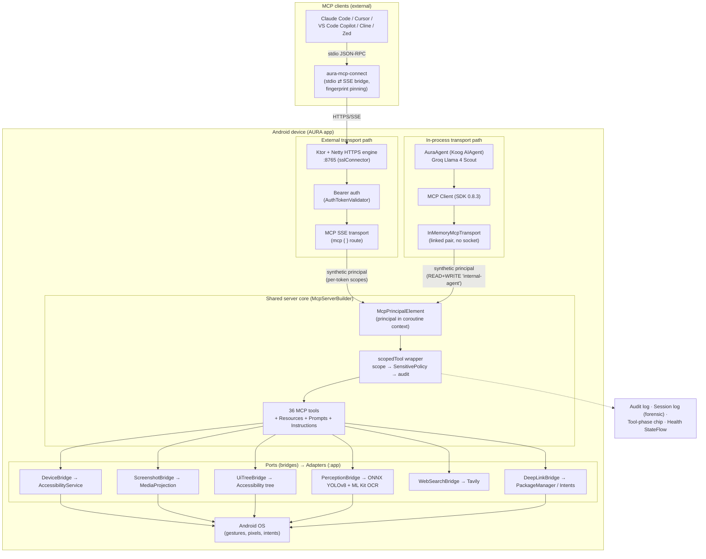

Three things to read off this diagram:

1. **One core, two front doors.** `McpServerBuilder.build(...)` is called by *both*
   `McpServerController` (external) and `InProcessMcpServer` (internal). The tool
   set, resources, prompts, and behavioral instructions are byte‑for‑byte identical.
2. **The principal is the only difference at the boundary.** External requests carry
   a `TokenPrincipal` derived from the paired bearer token (with that pairing's
   scopes). The in‑process agent carries a fixed `internal-agent` principal with
   `READ + WRITE`. Both land in the coroutine context the same way.
3. **The chokepoint is unavoidable.** No tool is registered directly; every tool is
   registered through `scopedTool`, which means scope enforcement, the sensitive‑action
   policy, and audit logging run on *every* call from *either* path.

---

## 4. Technology stack — what we used and why

Every dependency below is a deliberate choice with a concrete justification. Versions
are pinned in `UI/gradle/libs.versions.toml`.

### 4.1 Core platform

| Technology | Version | Why this, and why not the alternative |
|---|---|---|
| **Kotlin** | 2.2.21 | Coroutines are load‑bearing: the auth principal is propagated through `suspend` tool handlers via a `CoroutineContext` element — no thread‑locals across the SDK boundary. Sealed types model health/policy/results exhaustively. |
| **JVM target** | 17 | Required by Koog 1.0.0 and its Ktor‑client stack; D8 desugars down to `minSdk 26`, so there is no device‑level cost. |
| **`minSdk`** | 26 | Bumped from 24 specifically because **Netty** (the only Ktor server engine that supports server‑side TLS) uses APIs unavailable below API 26. Real‑world impact is zero — every device running the accessibility workload is API 30+. |
| **Gradle multi‑module** | AGP 8.9.1 | `:mcp-server` is an `android-library`; `:app` is the `android-application`. The split is what keeps the server core free of app internals. |

### 4.2 MCP & transport

| Technology | Version | Why |
|---|---|---|
| **MCP Kotlin SDK (server)** | 0.8.3 | The official protocol implementation. Provides `Server`, JSON‑RPC dispatch, the `mcp { }` Ktor route, and delivers `instructions` at the `initialize` handshake. |
| **MCP Kotlin SDK (client)** | 0.8.3 | The on‑device agent is itself an MCP **client** of our own server. **Version‑matched** to the server on purpose — a split SDK classpath would be a runtime hazard. |
| **Ktor server** | 3.2.3 | The HTTP/SSE substrate. `mcp { }` uses Server‑Sent Events, so the `SSE` plugin is mandatory. |
| **Ktor engine: Netty** | 3.2.3 | **Chosen over CIO** because CIO's server engine *does not support TLS* (`UnsupportedOperationException` at engine init). MCP must run over HTTPS for a self‑signed‑cert local service, so Netty is the only viable engine. (This is also what forced `minSdk 26`.) |
| **kotlinx.serialization** | 1.7.3 | All tool I/O and the `/health` payload are typed `@Serializable` to avoid `Any`‑polymorphism serializer headaches. |
| **kotlinx.coroutines** | 1.8.1 | Structured concurrency for the in‑memory transport's delivery scope and the SSE session jobs. |

### 4.3 On‑device AI (the agent consumer)

| Technology | Version | Why |
|---|---|---|
| **Koog (`ai.koog:koog-agents`)** | 1.0.0 | JetBrains' GA on‑device agent framework (KMP → Android `.aar`). Bundles agent core + provider clients. Chosen because it runs the agent loop *on the JVM/Android side* and integrates cleanly with a tool registry. |
| **Groq (OpenAI‑wire‑compatible)** | — | Groq serves **Llama 4 Scout** (`meta-llama/llama-4-scout-17b-16e-instruct`) which is *natively multimodal (vision) + tool‑calling*, and extremely fast. Reused via Koog's `OpenAILLMClient` pointed at `https://api.groq.com/openai`. |
| **Ktor OkHttp client** | 3.3.3 | Pinned to match **Koog's transitive ktor‑client** (3.3.3) — deliberately *different* from the server‑side Ktor 3.2.3 — to avoid a split‑version Ktor classpath. Constructed explicitly because R8 drops the AAR's `META-INF/services` provider registration on Android. |

### 4.4 On‑device perception

| Technology | Version | Why |
|---|---|---|
| **ONNX Runtime (Android)** | 1.19.0 | Runs **Microsoft OmniParser `icon_detect`** (YOLOv8, INT8‑quantized, 19.6 MB) fully on‑device, with NNAPI acceleration and CPU fallback. Keeps pixels local. |
| **ML Kit Text Recognition** | 16.0.1 | On‑device OCR to resolve labels on CV‑detected boxes. |

### 4.5 Security & identity

| Technology | Version | Why |
|---|---|---|
| **BouncyCastle (`bcpkix`)** | 1.77 | Generates the self‑signed X.509 certificate (with Subject Alternative Names for every up interface incl. Tailscale `100.x`). |
| **AndroidX Security Crypto** | 1.1.0‑alpha06 | `EncryptedSharedPreferences` (AES‑256) for the bearer‑token store and the Tavily API key. |
| **AndroidX Biometric** | 1.2.0‑alpha05 | Gates sensitive pairing/identity actions. |
| **ZXing core** | 3.5.3 | Renders the pairing QR that carries the cert fingerprint. |

### 4.6 Host‑app infrastructure

| Technology | Version | Why |
|---|---|---|
| **Hilt** | 2.56.2 | DI for the broader app (the MCP bridge set is hand‑wired in the foreground service for explicitness). |
| **WorkManager** | 2.10.0 | Periodic retention cleanup of forensic session logs. |
| **Jetpack Compose / Material 3** | BOM 2024.09 | The MCP Center & pairing UI. |
| **Android NSD** | platform | mDNS/Bonjour advertisement on `_aura-mcp._tcp.` so clients can discover the server. |

`★ Insight ─────────────────────────────────────`
- Notice how many version pins are *defensive*, not cosmetic: Netty forces `minSdk 26`; the client SDK is matched to the server SDK; Koog's ktor‑client (3.3.3) is intentionally a *different* version from the server's ktor (3.2.3) to avoid a single split classpath. These are the kinds of decisions that read as "knows how the build actually resolves," not "added a dependency."
- "On‑device perception" is the privacy moat: the heavy model runs locally and only an *element list* + an *annotated* PNG cross the wire — never the raw frame for the detection step.
`─────────────────────────────────────────────────`

---

## 5. Module & package structure

Two Gradle modules plus one npm package. The boundary between them is the whole point.

```
aura-live-mcp/
├── UI/                                  # Android Gradle project (rootProject "aura_ui")
│   ├── settings.gradle.kts              # include(":app"), include(":mcp-server")
│   │
│   ├── mcp-server/                      # ── THE SERVER (android-library, ns com.aura.mcp) ──
│   │   └── src/main/kotlin/com/aura/mcp/
│   │       ├── McpServerController.kt   # Ktor/Netty HTTPS lifecycle, auth, SSE, health
│   │       ├── McpServerHealth.kt       # sealed status: Stopped/Starting/Listening/Crashed
│   │       ├── server/
│   │       │   ├── McpServerBuilder.kt          # pure factory: assembles the Server
│   │       │   ├── InProcessMcpServer.kt        # in-memory transport pair (agent path)
│   │       │   ├── ScopedToolRegistration.kt    # the scopedTool() chokepoint
│   │       │   ├── McpToolScopes.kt             # READ/WRITE classification (fail-closed)
│   │       │   ├── SensitivePolicy.kt           # hard-block gate (local, fail-closed)
│   │       │   ├── McpPrincipalContext.kt       # coroutine-context principal element
│   │       │   └── McpResources.kt / McpPrompts.kt / AuraInstructions.kt
│   │       ├── tools/                   # 14 files → 36 registered tools
│   │       │   ├── DeviceTools, GestureTools, KeyTools, AppTools
│   │       │   ├── PerceptionTools, PerceiveScreenTool, PerceptionAiTools
│   │       │   ├── VerifyActionTool, WaitForTool, ScrollToElementTool
│   │       │   ├── DeepLinkTools, WebSearchTool, PolicyTools
│   │       │   ├── EchoTool, EndSessionTool
│   │       │   └── UiTreeToElements, UiTreeHeuristics, ToolHelpers (support)
│   │       └── bridge/                  # PORTS (interfaces) + cross-cutting contracts
│   │           ├── DeviceBridge, ScreenshotBridge, UiTreeBridge,
│   │           │   PerceptionBridge, WebSearchBridge, DeepLinkBridge
│   │           └── AuthTokenValidator, TlsConfig, McpAuditLogger,
│   │               ToolPhaseSink, SessionLogSink, ConnectionTracker
│   │
│   └── app/                             # ── THE HOST (android-application, ns com.aura.aura_ui) ──
│       └── src/main/java/com/aura/aura_ui/
│           ├── mcp/
│           │   ├── bridge/              # ADAPTERS: AppDeviceBridge, AppScreenshotBridge,
│           │   │                        #   AppUiTreeBridge, AppPerceptionBridge,
│           │   │                        #   AppWebSearchBridge, AppDeepLinkBridge
│           │   │   ├── OnnxYoloRunner.kt        # YOLOv8 via ONNX Runtime
│           │   │   └── MlKitTextReader.kt       # on-device OCR
│           │   ├── auth/               # McpAuthTokenStore, McpTlsKeystore, SelfSignedCertGen
│           │   ├── discovery/          # McpServiceAdvertiser (mDNS)
│           │   ├── pairing/            # PairingBundle (.mcp.json), QrEncoder, LanAddressResolver
│           │   ├── audit/              # McpAuditRegistry, RingBufferAuditLogger
│           │   └── log/                # McpSessionLogger, McpSessionStore, PDF export, retention
│           ├── agent/                  # ── CONSUMER: on-device Koog agent (Phase-0 spike) ──
│           │   ├── AuraAgent.kt
│           │   ├── llm/GroqProvider.kt, KoogOpenAiToolArgRepair.kt
│           │   └── mcpbridge/McpTool.kt, McpToolRegistry.kt, McpToolSchemaParser.kt
│           └── services/AssistantForegroundService.kt   # wires + owns the server lifecycle
│
└── aura-mcp-connect/                    # npm pkg: stdio⇄SSE bridge, fingerprint pinning
```

**Why two modules and not one.** `:mcp-server` must never reference a concrete
Android service class. Keeping it a separate library makes that physically enforced
by the build graph: the server depends on *interfaces* (`DeviceBridge`, …); the app
depends on the server and supplies the *implementations*. The payoff is that the
server core is JVM‑unit‑testable and could be lifted into another app unchanged.

---

## 6. Foundational architectural patterns

Five patterns carry the whole design. Each maps to specific files.

### 6.1 Hexagonal architecture (ports & adapters)

The `:mcp-server` module declares **what** it needs from the device as a set of
*ports* (Kotlin interfaces in `bridge/`). The `:app` module provides **how** via
*adapters* (`App*Bridge` classes). The bridges are the **only** doorway between the
modules.

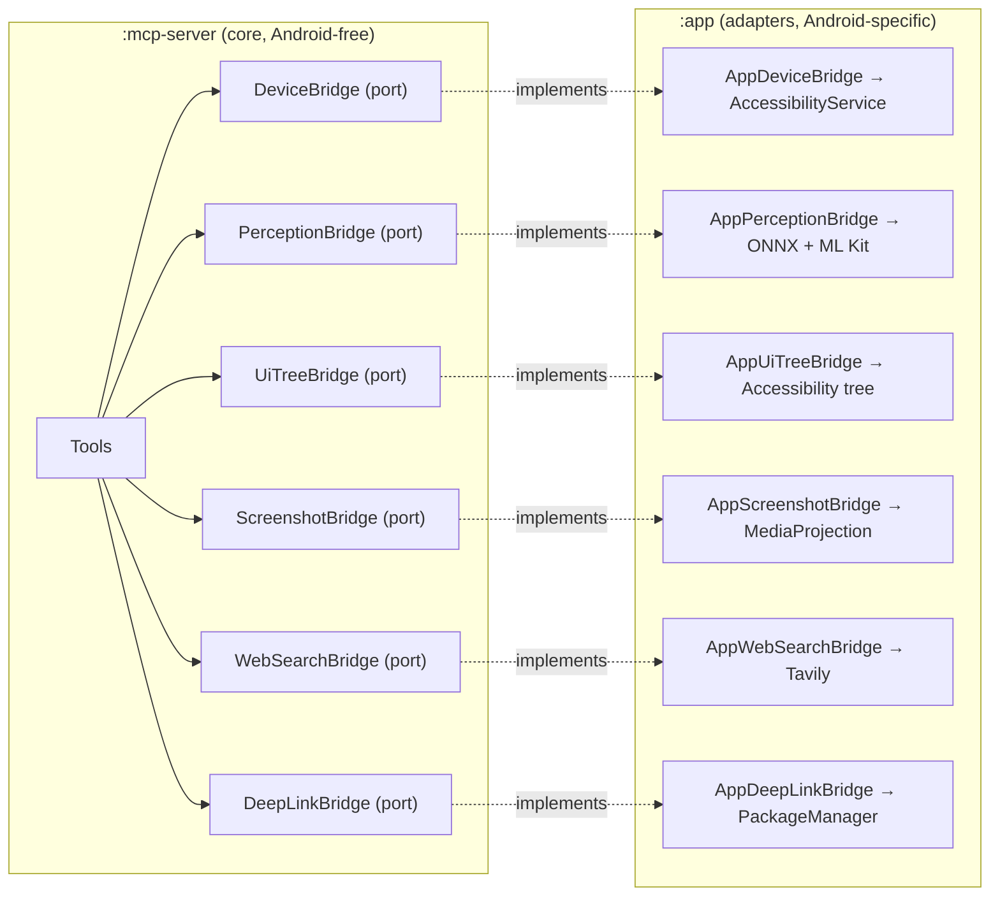

Every port's KDoc explicitly calls itself a "Port (Hexagonal Architecture term)."
The contracts are deliberately *minimal and JSON‑shaped* (e.g. `UiTreeBridge.snapshot()`
returns a *pre‑serialized JSON string* so the server never has to know the tree's
internal schema — the adapter can evolve it freely).

### 6.2 The single chokepoint (`scopedTool`)

No tool is registered with the SDK's raw `addTool`. Every tool goes through
`Server.scopedTool(...)`, which wraps the handler with scope enforcement, the
sensitive‑action policy, phase/session/audit sinks, and error capture. This is the
**one place** authorization happens — adding a tool cannot accidentally bypass it.
([§8](#8-the-tool-layer-and-the-scopedtool-pipeline) details the pipeline.)

### 6.3 Coroutine‑context principal propagation

Because MCP tool handlers are `suspend` lambdas, the authenticated identity is carried
as a `CoroutineContext` element (`McpPrincipalElement`) rather than a thread‑local.
Ktor's auth interceptor installs it once at the SSE handshake with
`withContext(McpPrincipalElement(principal)) { proceed() }`, and it propagates
automatically to every tool dispatch on that long‑lived connection — across the MCP
SDK boundary, with no manual passing of `call` references.

```kotlin
// McpPrincipalContext.kt — read inside any suspend tool handler:
internal suspend fun currentMcpPrincipalOrNull(): TokenPrincipal? =
    coroutineContext[McpPrincipalElement]?.principal
```

This is the mechanism that lets the *external* and *internal* paths share one
security model: each just installs a different principal on the delivery context.

### 6.4 In‑memory transport pair (process‑internal MCP)

The MCP SDK 0.8.3 ships only WebSocket/SSE transports. To let the on‑device agent
talk to the on‑device server **without a socket**, `InMemoryMcpTransport` implements
the SDK's `Transport` interface as a *linked pair*: each end's `send` delivers to the
peer's registered `onMessage`. The client end runs in a plain context; the server end
carries the synthetic `internal-agent` principal — so the agent's calls flow through
the exact same scope + policy + audit path as a remote client. (See
[ADR‑004](#adr-004-in-memory-transport-for-the-on-device-agent).)

### 6.5 Sealed‑type state & results

Runtime state is modeled with exhaustive sealed hierarchies — `McpServerHealth`
(`Stopped`/`Starting`/`Listening`/`Crashed`), `SensitivePolicy.Decision`
(`Allow`/`Block`), `CaptureResult`, `WebSearchResult` — so consumers handle every
case with no `else` branch and the compiler enforces completeness.

---

## 7. The server core

### 7.1 `McpServerBuilder` — the pure factory

`McpServerBuilder.build(...)` constructs the SDK `Server`, declares capabilities
(tools with `listChanged`, plus static resources and prompts), attaches the
behavioral `instructions` (delivered at the `initialize` handshake), and registers
all 36 tools, the resources, and the prompts. It is **engine‑agnostic** — it knows
nothing about Ktor or Netty — which is exactly why both the HTTPS controller and the
in‑process server can call it.

It also installs the three cross‑cutting sinks (`auditSink`, `phaseSink`,
`sessionSink`) before any tool registration, so `scopedTool` can read them.

### 7.2 `McpServerController` — the external HTTPS lifecycle

This is the production front door. Responsibilities:

- **HTTPS via `sslConnector`** using the `TlsConfig` material (self‑signed cert).
  There is **no plaintext HTTP fallback**.
- **Bearer authentication** (`Authentication { bearer { … } }`) — validates the token
  via `AuthTokenValidator`, stashes the full `TokenPrincipal` on the call attributes.
- **Principal injection** — a post‑auth `intercept(ApplicationCallPipeline.Call)`
  pulls the principal off the call and runs the entire long‑lived SSE session inside
  `withContext(McpPrincipalElement(principal))`. Auth therefore runs **once per
  pairing‑session**, not per tool call.
- **Connection tracking** — registers each SSE session with `ConnectionTracker`,
  stashes its `Job` so the UI can force a targeted disconnect, and unregisters in a
  `finally` (survives cancellation / network drop).
- **Unauthenticated probes** — `GET /health` (typed `HealthResponse`) and
  `GET /.well-known/aura-cert.pem` (cert download for trust bootstrap).
- **Observable health** — a `StateFlow<McpServerHealth>` is the single source of
  truth for the notification chip and the in‑app status badge.
- **Reachability enumeration** — at bind time it snapshots every non‑loopback IPv4/IPv6
  (LAN, Tailscale `tun0`) so the pairing UI shows URLs that actually work.

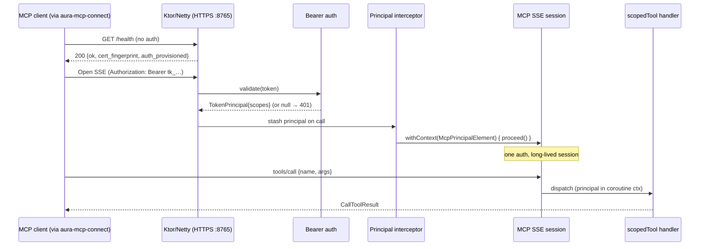

### 7.3 `InProcessMcpServer` — the internal front door

`InProcessMcpServer.connect(...)` builds a *dedicated* `Server` from the same
`McpServerBuilder`, creates the linked `InMemoryMcpTransport` pair, binds the server
end (carrying the `internal-agent` principal), and returns an `InProcessMcpHandle`
whose `clientTransport` is handed to the agent's MCP `Client`. Closing the handle
tears down the server and cancels the transport scope.

The delivery design detail that matters: inbound messages are dispatched with
`scope.launch(deliveryContext) { handler(message) }` — an *async* launch rather than
inline invocation — so request→response re‑entrancy doesn't recurse on a single
coroutine.

---

## 8. The tool layer and the `scopedTool` pipeline

`scopedTool` (in `ScopedToolRegistration.kt`) is a drop‑in replacement for the SDK's
`Server.addTool` that wraps **every** handler. Its ordering is deliberate — cheap,
deterministic checks first; side effects only after everything has passed.

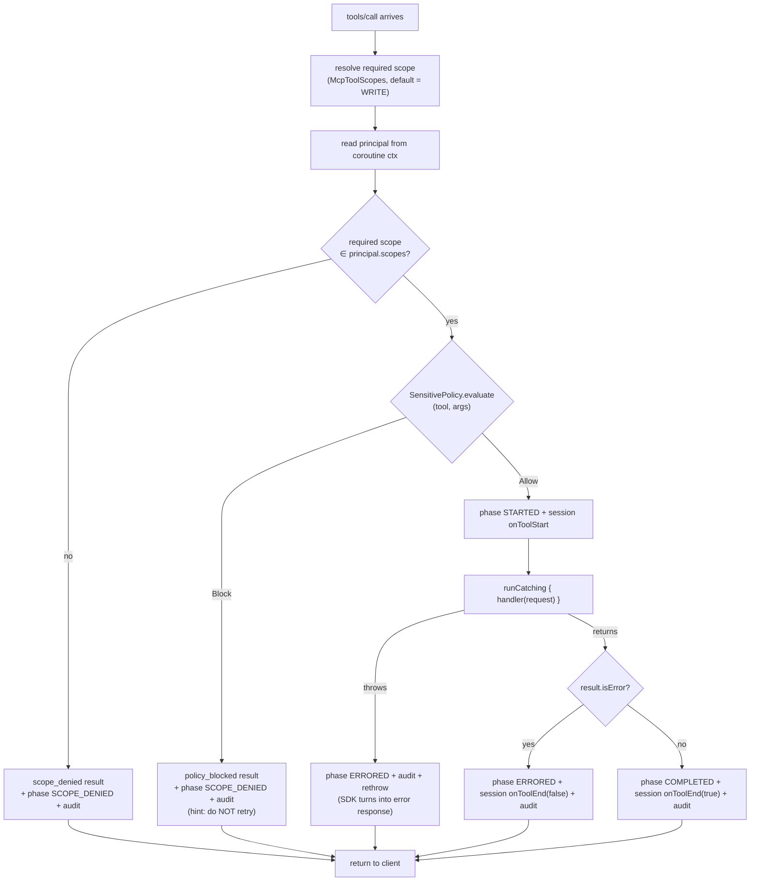

Key properties:

- **Wrapper, not interceptor.** The MCP SDK owns SSE body parsing and JSON‑RPC
  dispatch, so the tool *name* is only known inside the SDK pipeline — hence a
  per‑handler wrapper rather than a routing‑level filter.
- **Rich denial payloads.** A scope denial returns the required scope, the held
  scopes, and a remediation hint ("re‑pair and enable *Allow device control*"). A
  policy block returns the category and an explicit instruction *not to retry or seek
  a workaround*. These are designed to be read by an LLM and acted on correctly.
- **Audit is total.** Name, principal id (token short id, never the secret),
  success/denied flags, duration, and a truncated error string are logged for every
  call on every outcome path.
- **Output summaries are bounded.** The forensic session sink records only the first
  text content, truncated to 2 000 chars, so a base64 screenshot can't balloon the log.

### 8.1 Scope classification (`McpToolScopes`)

A single map classifies each tool as `READ` (inspection only — cannot move pixels or
change state) or `WRITE` (drives the device). The default for an unlisted tool is
**`WRITE`** — i.e. **fail‑closed**: forgetting to classify a new tool denies read‑only
clients rather than silently granting them control. Notable judgment calls:
`request_screen_capture_permission` and `get_screenshot` are READ (they only open a
consent dialog / inspect), `web_search` is READ (worst case is a wasted API credit).

### 8.2 Tool families (14 source files → 36 tools)

| Family | File(s) | Representative tools |
|---|---|---|
| Device status & basics | `DeviceTools` (7) | `get_device_status`, `tap`, `press_home`, `press_back`, `volume_*`, `mute`, `open_recent_apps` |
| Gestures | `GestureTools` (4 static + 4 looped) | `swipe`, `scroll_to`, `double_tap`, `long_press`, `scroll_up/down/left/right` |
| Keys & text | `KeyTools` (2) | `press_enter`, `type_text` |
| Apps | `AppTools` (3) | `launch_app`, `lookup_app`, `connect_device` |
| Perception | `PerceptionTools` (4) + `PerceiveScreenTool` (1) | `get_screenshot`, `request_screen_capture_permission`, `get_ui_tree`, `watch_device_events`, `perceive_screen` |
| Flow control | `VerifyActionTool`, `WaitForTool`, `ScrollToElementTool` | `verify_action`, `wait_for`, `scroll_to_element` |
| Deep links | `DeepLinkTools` (3) | `list_app_deeplinks`, `resolve_deeplink`, `open_deeplink` |
| Web / policy / lifecycle | `WebSearchTool`, `PolicyTools` (2), `EchoTool`, `EndSessionTool` | `web_search`, `validate_action`, `echo`, `end_session` |

### 8.3 Resources, Prompts & Instructions (the agent's guard‑rails)

Beyond tools, the server exposes the other two MCP primitives, plus handshake
instructions:

- **Resources** (read‑only context): the sensitive‑action policy document, a
  tool‑selection guide, and live device status — pullable on demand.
- **Prompts** (vetted runbooks): `automate_task`, `open_app` — templates that bake in
  the *perceive → act → verify*, *deep‑link‑first* discipline.
- **`AuraInstructions`**: a 7‑section behavioral contract delivered once at
  `initialize`. It encodes the *tool‑selection decision tree* (deep‑link first; never
  pass a coordinate you didn't just receive; one consequential action per turn;
  `wait_for` after navigation; "when labels and pixels disagree, believe the pixels";
  and the hard‑block safety boundary). This is how a *generic* MCP client (which has
  never seen AURA) is steered into safe, high‑success behavior.

---

## 9. Security architecture (defense in depth)

Five independent layers stand between a network packet and a gesture. Each is
defeatable only by also defeating the ones above it.

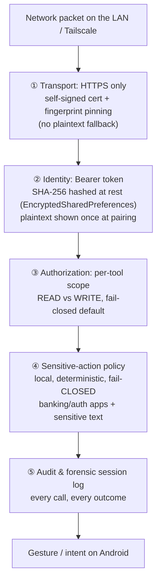

### 9.1 Layer ① — Transport (TLS, self‑signed, pinned)

`McpTlsKeystore` generates a self‑signed **RSA‑2048** cert on first run, persists the
keypair to a `PKCS12` file in `MODE_PRIVATE` app storage, and exposes the SHA‑256
fingerprint. A **schema‑version sidecar** (`mcp_tls.version`) lets a cert‑format bump
(e.g. adding Subject Alternative Names for every interface, including Tailscale `100.x`)
auto‑regenerate on next start — no manual `adb shell rm`.

**Why self‑signed, not Let's Encrypt:** the server only ever runs on the user's LAN
under a private IP. Public CAs can't issue for `192.168.x.x` / `.local`. Self‑signed +
**client‑side fingerprint pinning** is the canonical local‑only pattern (Syncthing,
Tailscale's `tsnet`). The inherent trade‑off — Ktor's `sslConnector` needs *direct*
access to the private key, which precludes fully hardware‑backed storage — is
documented and accepted.

### 9.2 Layer ② — Identity (bearer tokens)

`McpAuthTokenStore` mints 256‑bit `SecureRandom` tokens formatted `tk_<64 hex>`. It
persists **only the SHA‑256 hash**; the plaintext is surfaced exactly once, in the
pairing UI. So even an attacker who decrypts the prefs file cannot impersonate a
client. A `ReentrantReadWriteLock`‑protected cache keeps validation O(1) on the hot
path — *many readers (every Ktor request thread), rare writers (pairing/revocation)*,
which is precisely the RWLock's sweet spot. Tokens carry scopes and an optional human
label ("Work Mac") that shows up in the activity log.

### 9.3 Layer ③ — Authorization (per‑tool scopes)

Covered in [§8.1](#81-scope-classification-mcptoolscopes). The principal's scope set is
compared against the tool's required scope at dispatch. A read‑only pairing simply
cannot call `tap`.

### 9.4 Layer ④ — Sensitive‑action policy (`SensitivePolicy`)

A local, deterministic gate that **hard‑blocks** the consequential entry points an
agent would use to reach a sensitive surface:

- `launch_app` / `open_deeplink` → blocked for banking/payment apps (exact package +
  banking keyword pattern), authenticator/password managers, and banking deep‑link
  *hosts*. Blocking *entry* means the agent never gets *into* the app.
- `type_text` → blocked for card numbers (**Luhn‑checked** 13–19 digit runs), CVV/SSN,
  and "password is…/pin is…" patterns.

Raw `tap`/`swipe` are coordinate‑only and semantically opaque, so they're intentionally
**not** gated (a tap inside an already‑open app isn't classifiable).

> **Fail‑closed vs fail‑safe — a deliberate inversion.** The *legacy* network policy
> (OPA Rego + PromptGuard) was **fail‑safe** (allow on error) because it called remote
> services that could flake. `SensitivePolicy` is **local and deterministic** — there
> is no transient error to forgive — so it is **fail‑closed** (block on match). It is
> the on‑device port of the legacy policy, and the change in posture is a direct
> consequence of moving the decision on‑device.

### 9.5 Layer ⑤ — Audit & forensic session log

Every call is logged by `scopedTool` to the audit sink (ring buffer, surfaced in the
MCP Center). A separate **forensic session log** records per‑call records — args,
output summary, raw screenshots, agent identity — with WorkManager‑driven retention
cleanup and PDF export. This is the "what did the agent actually do on my phone"
accountability surface.

---

## 10. The perception pipeline (dual‑track Set‑of‑Marks)

This is the subsystem that makes reliable tapping possible, and it enforces the
project's central invariant in its very shape.

> **The VLM never returns pixel coordinates.** It only ever *selects a numbered box*.
> Coordinates come from the accessibility tree (factual) or an on‑device CV model
> (probabilistic) — never from the language model.

### 10.1 Why two tracks

| Source | Strength | Weakness |
|---|---|---|
| **UI tree** (accessibility) | Pixel‑accurate bounds, free, factual | Misses WebView/Canvas/Maps/games/custom‑rendered widgets; labels often wrong |
| **OmniParser CV** (YOLOv8 + OCR) | Sees *anything* drawn on screen | Model‑derived bounds, probabilistic |

`perceive_screen` uses **both, every time**, and merges them so the agent gets
structural *and* visual ground truth simultaneously.

### 10.2 The merge algorithm (`PerceiveScreenTool`)

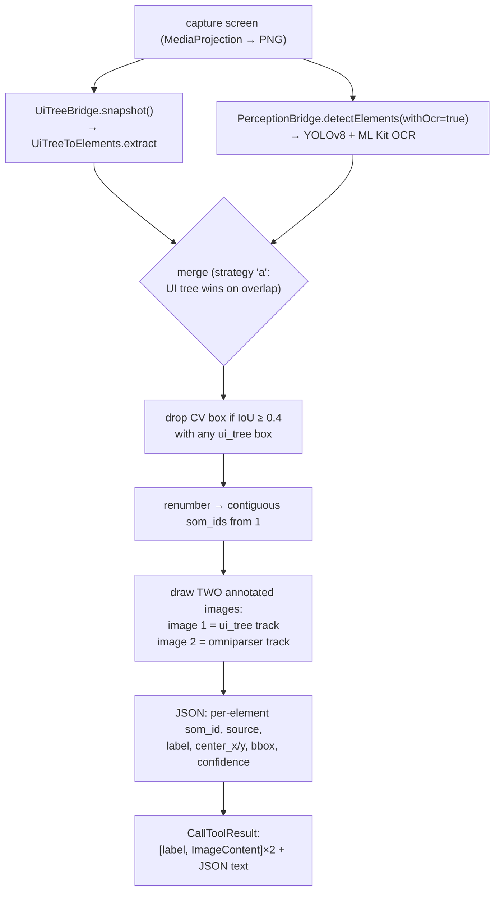

- **UI tree is primary** — if it yields ≥ 3 interactive elements, those become the SoM
  boxes.
- **OmniParser fills gaps** — every CV box is dropped if it overlaps an existing
  UI‑tree box (**IoU ≥ 0.4**); the rest are appended.
- **OmniParser is the sole source** when the tree is empty/below threshold (WebView,
  Canvas, Maps, games).
- Every element carries a **`source`** field (`ui_tree` / `omniparser`) so the agent
  can weight trust — "when they disagree, believe the pixels."

The annotation is *decoupled* from detection: `drawAnnotations` takes an
externally‑supplied element list, so the tool layer chooses its source of truth
(UI‑tree bounds are drawn from factual accessibility bounds, not the model's output).

### 10.3 On‑device CV (`OnnxYoloRunner`)

Runs **Microsoft OmniParser `icon_detect`** (YOLOv8, INT8‑quantized, 19.6 MB ONNX
shipped as an uncompressed asset) via ONNX Runtime:

1. **Letterbox** the source bitmap into 640×640 keeping aspect ratio (YOLO‑gray pad).
2. **CHW float32** normalization to `[0,1]`.
3. **Inference** — NNAPI delegate when available, CPU fallback. Output tensor
   `(1, 5, 8400)` is the standard YOLOv8 detect head (8400 anchors × cx,cy,w,h,conf).
4. **Confidence filter** (0.25) + **class‑agnostic NMS** (IoU 0.5).
5. **Inverse letterbox** — scale boxes back into source‑image coordinate space.

The `OrtSession` is lazily created once and is thread‑safe, so concurrent `detect()`
calls are fine. OCR labels come from `MlKitTextReader`.

### 10.4 How vision actually reaches the model

A subtle but important detail in the agent path: the MCP→Koog adapter (`McpTool`)
**strips non‑text content** (the base64 PNG `ImageContent`) from the *text* rendering
of a tool result — a model can't read base64 as text, and a screenshot blob would
overflow the context window. Instead, the annotated image reaches a vision‑capable
model through a **separate Koog `image()` attachment**. Text track and vision track are
kept distinct on purpose.

---

## 11. The on‑device agent — a consumer of the server

> **Maturity, stated plainly.** The on‑device agent is a **Phase‑0 spike that has
> been *proven*, not a finished product.** `AuraAgent` exposes only `runSpike` and
> `runVisionSpike`; it is triggered solely by a **debug‑only broadcast receiver** that
> never exists in a release build; the autonomous *perceive→act→verify* loop, the
> voice entry point, and the overlay UI are explicitly *later phases*. The most recent
> commit records the milestone honestly: *"Phase 0 — #80 PROVEN — vision path is
> green. This is the Phase 0 exit gate."* It is documented here because it is the
> **second consumer of the server** and demonstrates the in‑process path — not because
> it is shipped.

### 11.1 What the spike proves

Two pivotal unknowns were deliberately isolated and de‑risked before building the full
agent loop:

1. **The integration round‑trips on a real device** (`runSpike`): Koog `AIAgent` →
   in‑process MCP `Client` → in‑memory transport → the shared server → a real tool
   call (e.g. "get the device status") executed on hardware.
2. **The vision path is real** (`runVisionSpike`, GitHub issue #80): the chosen model,
   through Koog on Android, can actually *see* the SoM‑annotated screenshot and reason
   over pixels — not just the text element list. `perceive_screen` is called, the
   base64 PNG is pulled from the `ImageContent`, attached as a Koog `image()`, and a
   pixel‑only question is answered correctly. **This is the strongest part of the
   story**: the hardest unknown was isolated as a spike and proven before committing to
   the full build.

### 11.2 The agent wiring

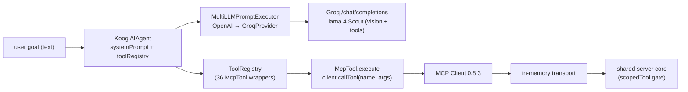

The adapter layer (`agent/mcpbridge/`) is **hand‑written** against MCP SDK 0.8.3
because Koog's own `agents-mcp` module is JVM‑only, beta, and targets SDK 0.11.1
(see [ADR‑003](#adr-003-hand-written-koog--mcp-08x-adapters)):

- `McpToolSchemaParser` — converts an MCP `Tool` definition into a Koog
  `ToolDescriptor`, handling the JSON‑Schema vocabulary the 36 tools actually use
  (string/integer/number/boolean/array/object/enum, nested objects). Unknown types
  fall back to `String` so a tool is never dropped from the registry.
- `McpToolRegistry` — discovers `client.listTools()` and wraps each as an `McpTool`.
- `McpTool` — a Koog `Tool` whose `execute` calls `client.callTool`; its
  `encodeResultToString` strips image/`_meta` content from the text rendering
  (see [§10.4](#104-how-vision-actually-reaches-the-model)).

### 11.3 A shipped correctness fix worth highlighting

`KoogOpenAiToolArgRepair` is an OkHttp interceptor that repairs **Koog 1.0.0 issues
#2095/#2096** — the OpenAI‑compatible client double‑JSON‑encodes tool‑call arguments
(`{}` goes out as `"{}"`), which strict backends like Groq reject with HTTP 400. The
fix unwraps exactly one string layer on the wire and is **self‑disabling**: once
arguments are correctly encoded (after a future Koog upgrade) the decode throws and the
value is left untouched. It fails open (never breaks a request) and is reused by every
provider on Koog's OpenAI base. This is the kind of pragmatic, surgical
upstream‑bug workaround that keeps a real integration alive.

### 11.4 The provider (`GroqProvider`)

Groq is OpenAI‑wire‑compatible, so Koog's `OpenAILLMClient` is pointed at
`https://api.groq.com/openai`. The model descriptor declares
`Completion + Tools + Vision.Image + OpenAIEndpoint.Completions` capabilities — the
last one is required so Koog routes a non‑OpenAI model id to `/chat/completions`
(Groq only speaks chat‑completions). The Ktor OkHttp engine is constructed explicitly
(R8 drops the AAR's auto‑registration), and in debug builds a request‑body logger runs
**without headers** so the API key never lands in logcat.

---

## 12. Architecture Decision Records (ADRs)

Condensed ADRs capturing the load‑bearing decisions and their trade‑offs.

### ADR‑001: Run the MCP server *on the device*, not in the cloud
- **Decision.** Embed a standards‑compliant MCP server inside the Android app.
- **Forces.** Privacy (pixels/UI tree should not leave the device for perception),
  latency, and the desire for *any* MCP client to drive the phone with no bespoke
  protocol.
- **Consequences.** Perception must run on‑device (ONNX/ML Kit); the server must run a
  TLS HTTP stack inside an app (forces Netty → `minSdk 26`); the device becomes
  addressable on the LAN (forces pairing, discovery, and auth).

### ADR‑002: Hexagonal ports/adapters across a 2‑module split
- **Decision.** `:mcp-server` declares ports (`*Bridge`); `:app` provides adapters.
- **Why.** Keeps the server core Android‑framework‑free → JVM‑unit‑testable and
  reusable; the build graph *physically* prevents the core from reaching into app
  internals.
- **Trade‑off.** A little ceremony (every capability needs an interface + an adapter)
  in exchange for a hard architectural boundary.

### ADR‑003: Hand‑written Koog ⇄ MCP 0.8.x adapters
- **Decision.** Write `McpTool` / `McpToolRegistry` / `McpToolSchemaParser` instead of
  using Koog's `agents-mcp`.
- **Why.** Koog's module is JVM‑only, beta, and targets SDK **0.11.1**; the server is
  pinned to **0.8.3**. A version mismatch on the protocol SDK is unacceptable.
- **Trade‑off.** ~3 small files to maintain; removed when Koog ships an Android‑capable,
  0.8.x‑compatible module.

### ADR‑004: In‑memory transport for the on‑device agent
- **Decision.** Implement the SDK `Transport` as a linked in‑memory pair rather than
  looping back through the socket.
- **Why.** No TLS/auth overhead for a first‑party in‑process caller, *and* — crucially
  — it lets the agent reuse the **entire** security/audit/policy path by injecting a
  synthetic full‑scope principal on the server‑end coroutine context. Zero divergence
  between "what a remote client can do" and "what the on‑device agent can do."
- **Trade‑off.** One logical server per process (the sinks are top‑level `var`s) — which
  matches the deployment reality (one on‑device server).

### ADR‑005: Netty over CIO (and the `minSdk 26` bump)
- **Decision.** Use Ktor's Netty engine.
- **Why.** CIO's server engine does not support TLS; MCP must run over HTTPS for a
  self‑signed local service.
- **Consequence.** Netty needs API 26 → `minSdk` bumped from 24 (zero real‑world impact
  for this workload) and APK packaging needs `META-INF/INDEX.LIST` excludes (Netty
  ships 13 jars).

### ADR‑006: Self‑signed TLS + client fingerprint pinning
- **Decision.** Generate a self‑signed RSA‑2048 cert on device; clients pin its SHA‑256.
- **Why.** Public CAs can't issue for private LAN IPs; pinning is stronger than CA
  trust for IP‑based services (it trusts the *exact* key, not any CA). Same pattern as
  Syncthing/Tailscale.
- **Trade‑off.** Ktor needs the private key in‑process → not fully hardware‑backed; cert
  rotation requires re‑pairing (mitigated by the schema‑version auto‑regen + the npm
  wrapper's clear "re‑pair" error).

### ADR‑007: Sensitive‑action policy is local & fail‑closed
- **Decision.** Port the legacy network OPA Rego policy to a local, deterministic
  Kotlin gate that blocks on match.
- **Why.** At the MCP boundary there is no NL command string — only tool calls with
  args — so enforcement moves to the *entry points* (`launch_app`, `open_deeplink`,
  `type_text`). Local + deterministic ⇒ no transient error to forgive ⇒ fail‑closed.
- **Contrast.** The legacy remote policy was fail‑safe (allow on error) because it
  could flake; moving on‑device flips the safe default.

### ADR‑008: Universal `.mcp.json` + npm bridge for pairing
- **Decision.** Pairing emits a `.mcp.json` snippet invoking `aura-mcp-connect`, with
  the cert PEM and fingerprint inline.
- **Why.** Every MCP client supports the `command + args + env` stdio pattern; direct
  `type: "sse"` entries have inconsistent TLS behavior across hosts. Node ignores the
  OS trust store, so a wrapper is the right layer to inject *process‑scoped* CA trust.
- **Trade‑off.** A small npm package to publish/maintain, in exchange for a one‑copy‑paste,
  secure onboarding across all clients.

---

## 13. Pairing, discovery & the client bridge

### 13.1 Pairing (`PairingBundle`)

The AURA pairing screen generates a complete `.mcp.json` the user copies into their
client. The bundle carries everything needed in one blob:

- `--url` — the HTTPS root (LAN IP or Tailscale `100.x`).
- `--fingerprint` — the cert SHA‑256 (pinned on every connection).
- `--ca-pem-base64` — the cert PEM, inline, base64‑wrapped so it survives JSON without
  newline escaping.
- `env.AURA_BEARER_TOKEN` — the token in `env`, **not** the URL, so it never lands in
  shell history / proxy logs.

### 13.2 Discovery (`McpServiceAdvertiser`)

The server advertises over Android NSD (mDNS/Bonjour) as `_aura-mcp._tcp.`. The TXT
record carries `version`, `fp_sha256` (colons stripped for length), `auth=bearer`,
`scheme=https` — so a previously‑paired client can confirm it's reaching the *same*
server (not a LAN spoofer) without re‑pairing.

### 13.3 The client bridge (`aura-mcp-connect`)

A tiny stdio↔SSE Node bridge the client spawns. Three independent trust layers:

1. **Process‑scoped CA trust** — the HTTPS agent's `ca` is set to *only* the AURA PEM.
   No global trust changes, no OS‑trust‑store fallback.
2. **Strict fingerprint pinning** — `checkServerIdentity` byte‑compares the leaf
   SHA‑256; even a future cert from the same CA is rejected.
3. **Pre‑flight probe** — a one‑shot `tls.connect` verifies the fingerprint before the
   long‑lived SSE opens, so the user sees *"cert rotated — re‑pair"* instead of an
   opaque transport failure.

All log output goes to **stderr** — stdout is reserved for the MCP JSON‑RPC frames the
client consumes.

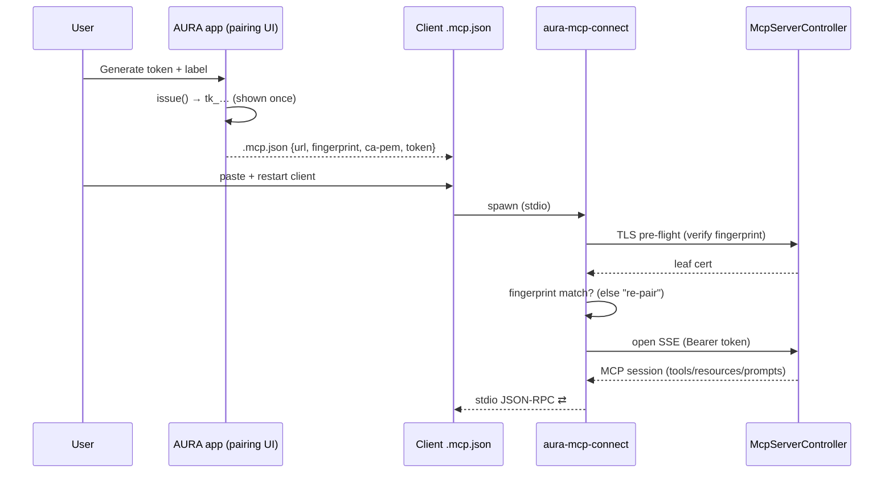

---

## 14. Observability & lifecycle

### 14.1 Four observability surfaces

`scopedTool` fans every call out to four sinks (all defaulting to no‑op so the core
stays testable):

| Sink | Interface | Purpose |
|---|---|---|
| **Audit log** | `McpAuditLogger` | Compact per‑call record (name, token id, success/denied, duration, error) → ring buffer in MCP Center. |
| **Tool‑phase chip** | `ToolPhaseSink` | Live `STARTED/COMPLETED/ERRORED/SCOPE_DENIED` events drive the status‑bar chip ("Acting…"). |
| **Forensic session log** | `SessionLogSink` | Full per‑call records incl. args, output summary, raw screenshots, agent identity; retention via WorkManager; PDF export. |
| **Connection tracker** | `ConnectionTracker` | Live list of connected clients (token id, label, remote addr) in MCP Center; supports targeted disconnect. |
| **Health** | `StateFlow<McpServerHealth>` | Single source of truth for the notification chip and status badge (`Stopped/Starting/Listening/Crashed` with reason). |

### 14.2 Server lifecycle (`AssistantForegroundService`)

The server's lifecycle is tied to a **foreground service** (Android's requirement for
a long‑running, user‑visible background process). The service hand‑wires the entire
bridge set and starts the controller:

```kotlin
McpServerController(
    deviceBridge      = AppDeviceBridge(appContext),
    screenshotBridge  = sharedScreenshotBridge,        // shared with the session logger
    uiTreeBridge      = AppUiTreeBridge(),
    perceptionBridge  = AppPerceptionBridge(appContext),
    webSearchBridge   = AppWebSearchBridge(TavilyKeyStore(appContext)),
    deepLinkBridge    = AppDeepLinkBridge(appContext, DeepLinkManager(...)),
    authTokenValidator= tokenStore,                    // McpAuthTokenStore
    auditLogger       = McpAuditRegistry.INSTANCE,
    toolPhaseSink     = StatusToolPhaseSink(statusController),
    sessionLogSink    = sessionLogger,
    connectionTracker = AppConnectionTracker(),
    tlsConfig         = TlsConfig(/* from McpTlsKeystore */),
)
```

It binds to `0.0.0.0:8765` (reachable over both `adb forward` and the device's WiFi IP)
and registers the mDNS advertiser on start, unregistering on stop. The user toggles the
server from the in‑app MCP Center (`ACTION_MCP_START` / `ACTION_MCP_STOP`).

`★ Insight ─────────────────────────────────────`
- The bridge set is *hand‑wired* in the service rather than Hilt‑injected — a
  deliberate choice for an explicit, auditable composition root for the
  security‑sensitive server (you can see exactly which adapters back which ports).
- The screenshot bridge is *shared* between the server and the session logger so both
  see the same `MediaProjection` grant — capturing twice would double‑prompt the user.
`─────────────────────────────────────────────────`

---

## 15. Complete tool inventory (36 tools)

Authoritative source: `McpToolScopes.toolScopeMap`. **16 READ + 20 WRITE = 36.**

### READ tools (passive inspection — granted even to read‑only pairings)

| Tool | What it does |
|---|---|
| `echo` | Proof‑of‑life / connectivity check. |
| `get_device_status` | Screen size, API level, model, accessibility‑service state. |
| `get_screenshot` | Raw PNG (no boxes) — for reading content, never for computing taps. |
| `request_screen_capture_permission` | Opens the MediaProjection consent dialog. |
| `get_ui_tree` | Raw accessibility tree (cheap, ~50 ms, no screenshot). |
| `watch_device_events` | Timeboxed batched read of accessibility events. |
| `perceive_screen` | **Dual‑track SoM**: 2 annotated images + element list w/ centers. |
| `verify_action` | Returns fresh state to confirm the last action landed. |
| `wait_for` | Blocks until a screen settles (mandatory after navigation). |
| `lookup_app` | Resolve a human app name → package (confidence‑ranked candidates). |
| `web_search` | Tavily task‑grounding search (answer + ranked snippets). |
| `validate_action` | Pre‑check a target against `SensitivePolicy` before committing. |
| `connect_device` | Phase‑3 stub (no hardware touch). |
| `list_app_deeplinks` | Discover an app's deep links (trust‑tagged). |
| `resolve_deeplink` | Dry‑run a URI: does it resolve, to which package, scheme allowed? |
| `end_session` | Agent‑callable session boundary marker. |

### WRITE tools (device control — require a write‑scoped pairing)

| Tool | What it does |
|---|---|
| `tap` | Tap at (x, y) — coordinate must come from a perception result. |
| `double_tap` / `long_press` | Compound taps at a point. |
| `swipe` | Swipe (x1,y1)→(x2,y2) over a duration. |
| `scroll_to` | Swipe‑style directed scroll. |
| `scroll_up` / `scroll_down` / `scroll_left` / `scroll_right` | 50%‑screen directional scrolls (registered via loop). |
| `scroll_to_element` | Composite: perceive + scroll until the target is found. |
| `press_home` / `press_back` / `open_recent_apps` | System navigation. |
| `press_enter` | Inject Enter on the focused editor (e.g. submit search). |
| `type_text` | Type into the focused field (policy‑gated for secrets). |
| `volume_up` / `volume_down` / `mute` | Media volume. |
| `launch_app` | Launch by package (policy‑gated for banking/auth apps). |
| `open_deeplink` | Fire a pinned `ACTION_VIEW` intent (policy‑gated; scheme‑allowlisted). |

---

## 16. End‑to‑end request walkthroughs

### 16.1 External client performs a reliable tap

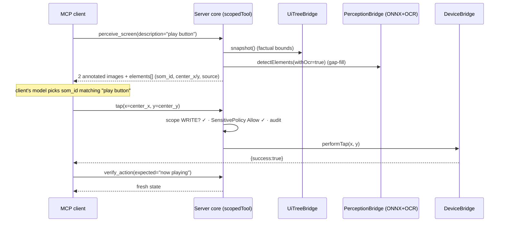

### 16.2 A sensitive action is hard‑blocked

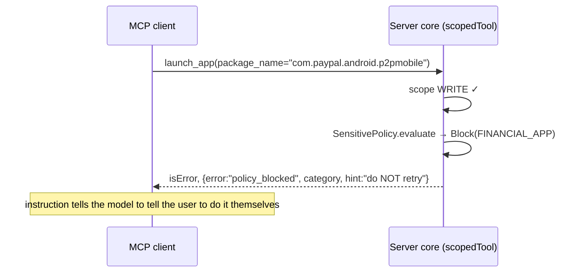

### 16.3 The on‑device agent runs a goal (in‑process path)

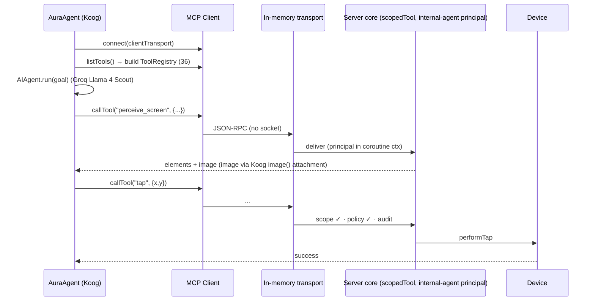

---

## 17. Résumé / interview talking points

Drop‑in bullets (rephrase to taste), each backed by something concrete in this document.

**Résumé bullets**

- Built an **on‑device Model Context Protocol (MCP) server for Android** that exposes
  **36 typed device‑control and perception tools**, letting any MCP client (Claude
  Code, Cursor, VS Code Copilot) drive a real phone over a secured LAN connection.
- Designed a **dual‑consumption architecture** where external clients (HTTPS/SSE via
  Ktor + Netty) and an in‑process on‑device AI agent (in‑memory transport) converge on
  a **single server core and a single authorization chokepoint** — zero divergence in
  tool surface or security model.
- Engineered an **on‑device perception pipeline** (YOLOv8 via ONNX Runtime + ML Kit
  OCR + accessibility‑tree fusion) producing **Set‑of‑Marks** annotated screenshots, so
  the language model **selects numbered elements instead of hallucinating pixel
  coordinates** — keeping raw frames on the device.
- Implemented **defense‑in‑depth security**: self‑signed TLS with client **fingerprint
  pinning**, SHA‑256‑hashed **bearer tokens** in `EncryptedSharedPreferences`,
  **per‑tool capability scopes** (fail‑closed), and a **local fail‑closed
  sensitive‑action policy** that hard‑blocks banking/auth apps and secret entry.
- Shipped an **npm client bridge** (`aura-mcp-connect`) giving every MCP client
  one‑copy‑paste, fingerprint‑pinned trust of the device's self‑signed cert.
- Applied **hexagonal architecture** (ports/adapters across a 2‑module Gradle split) to
  keep the server core Android‑framework‑free and JVM‑unit‑testable.

**Deeper talking points (the "why" an interviewer will probe)**

- *Why does the in‑process agent share the external security path?* Because the
  in‑memory transport injects a synthetic principal into the **coroutine context**;
  `suspend` tool handlers read it the same way they read a remote client's principal —
  so scope, policy, and audit run identically on both paths with no second code path to
  keep in sync.
- *Why coroutine context and not thread‑locals?* The MCP SDK owns dispatch across
  thread boundaries; a `CoroutineContext` element propagates through `suspend` calls
  automatically, which a thread‑local would not survive.
- *Why fail‑closed here when the legacy policy was fail‑safe?* The legacy policy called
  remote services that could flake (so it allowed on error). The on‑device policy is
  local and deterministic — there's no transient error to forgive — so blocking on
  match is correct.
- *Why Netty, why `minSdk 26`?* Ktor's CIO engine can't do server‑side TLS; MCP needs
  HTTPS for a self‑signed local service; Netty needs API 26 — a chain of forced,
  defensible decisions.
- *Why hand‑written Koog adapters and a wire‑level arg‑repair interceptor?* Koog's MCP
  module targets a different SDK version and is JVM‑only; and Koog 1.0.0 double‑encodes
  tool‑call arguments (#2095/#2096) which Groq rejects — the self‑disabling repair keeps
  the integration working until an upstream fix ships.
- *What's actually done vs. in progress?* The **server** is production‑grade and
  complete (TLS, auth, scopes, policy, audit, pairing, mDNS, connection tracking). The
  **on‑device agent** is a **proven Phase‑0 spike** — the two pivotal unknowns
  (Koog‑on‑device round‑trip and the vision path) were deliberately de‑risked first and
  proven (issue #80 exit gate); the autonomous loop, voice, and overlay are next.

---

### Appendix — file map for quick navigation

| Concern | Primary file(s) |
|---|---|
| External HTTPS lifecycle, auth, SSE, health | `mcp-server/.../McpServerController.kt` |
| In‑process transport (agent path) | `mcp-server/.../server/InProcessMcpServer.kt` |
| Pure server factory | `mcp-server/.../server/McpServerBuilder.kt` |
| The authorization chokepoint | `mcp-server/.../server/ScopedToolRegistration.kt` |
| Scope map (fail‑closed) | `mcp-server/.../server/McpToolScopes.kt` |
| Sensitive‑action policy | `mcp-server/.../server/SensitivePolicy.kt` |
| Principal propagation | `mcp-server/.../server/McpPrincipalContext.kt` |
| Behavioral contract | `mcp-server/.../server/AuraInstructions.kt` |
| Dual‑track perception tool | `mcp-server/.../tools/PerceiveScreenTool.kt` |
| Ports (interfaces) | `mcp-server/.../bridge/*.kt` |
| On‑device CV | `app/.../mcp/bridge/OnnxYoloRunner.kt` |
| TLS keystore / cert | `app/.../mcp/auth/McpTlsKeystore.kt` |
| Token store | `app/.../mcp/auth/McpAuthTokenStore.kt` |
| mDNS discovery | `app/.../mcp/discovery/McpServiceAdvertiser.kt` |
| Pairing `.mcp.json` | `app/.../mcp/pairing/PairingBundle.kt` |
| Koog agent (spike) | `app/.../agent/AuraAgent.kt` |
| Koog⇄MCP adapter | `app/.../agent/mcpbridge/McpTool.kt` |
| Koog arg‑repair | `app/.../agent/llm/KoogOpenAiToolArgRepair.kt` |
| Server lifecycle wiring | `app/.../services/AssistantForegroundService.kt` |
| Client trust bridge | `aura-mcp-connect/` |

*End of document.*


