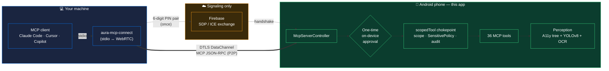
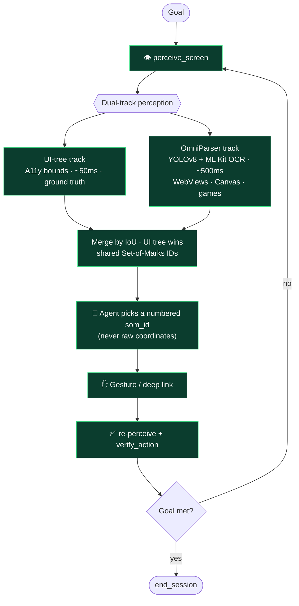
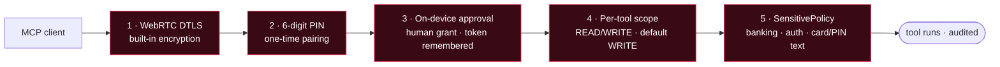
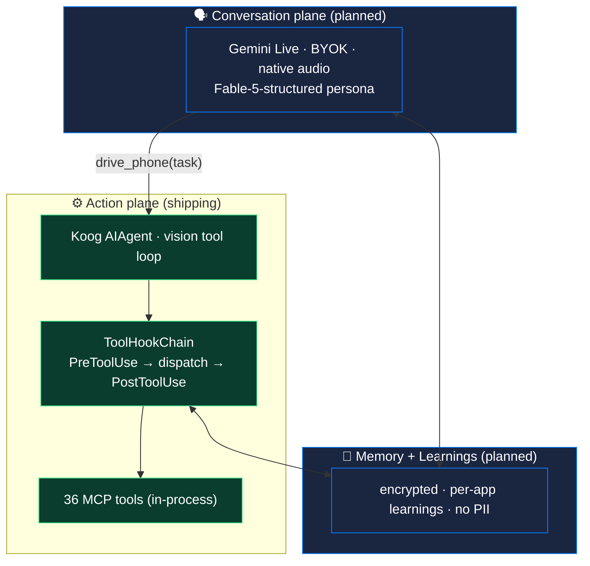

<h1 align="center">AURA</h1>

<p align="center">
  <strong>Turn a physical Android phone into a Model Context Protocol server — over WebRTC.</strong><br/>
  Any MCP client — Claude Code, Cursor, Copilot — drives real hardware peer-to-peer. No root, no ADB, no cloud round-trip.<br/>
  Plus a first-party <strong>on-device agent</strong> that drives the same tools by voice or text, with the LLM brain of your choice.
</p>

<p align="center">
  
  
  
  
  
  
  
  
</p>

---

## At a glance



> **No cloud in the data path.** Firebase carries only the WebRTC handshake (SDP/ICE). Once the DataChannel is up, every tool call travels **directly, phone ⇄ PC, DTLS-encrypted** — the signaling server never sees your screen or your taps.

---

## The idea

Most "phone automation" leans on something heavy: a rooted device, an ADB session tethered to a laptop, or a cloud backend that screen-scrapes over a slow round-trip. This takes the opposite route — the **MCP server runs *inside* the Android app itself**, and clients reach it **peer-to-peer over WebRTC**.

A coding agent that already speaks MCP pairs once with a 6-digit PIN, you approve it on the phone, and it gets 36 tools: see the screen, tap, type, scroll, launch apps, open deep links, control volume. The agent reasons about a real UI and acts on real pixels, with nothing in the data path but a DTLS DataChannel.

---

## What it does

36 tools across seven capability groups, every one callable from a standard MCP client. The full surface was driven live against a physical handset during development — taps, scrolls, dual-track perception, deep-link discovery and opening, and the full perceive→act→verify loop all confirmed on real hardware.

| Group | Tools | What the agent can do |
|---|---|---|
| **Perception** | `perceive_screen` · `get_screenshot` · `get_ui_tree` · `get_device_status` · `watch_device_events` | See the screen two ways at once (below), read raw structure, or stream device events |
| **Gestures** | `tap` · `double_tap` · `long_press` · `swipe` · `scroll_{up,down,left,right}` · `scroll_to` · `scroll_to_element` · `type_text` · `press_enter` | Touch and text input via the Accessibility API |
| **Navigation** | `press_home` · `press_back` · `open_recent_apps` · `launch_app` | Move between apps and screens |
| **System** | `volume_up` · `volume_down` · `mute` | Media key control |
| **Flow control** | `verify_action` · `wait_for` · `validate_action` | Close the loop: confirm an action landed, wait for a screen to settle |
| **Deep links** | `list_app_deeplinks` · `resolve_deeplink` · `open_deeplink` | Discover an app's deep links and jump straight to in-app content — the express lane past gesture navigation |
| **Meta / web** | `lookup_app` · `connect_device` · `request_screen_capture_permission` · `echo` · `end_session` · `web_search` | Pairing, capability checks, task-grounding search (Tavily) |

### The perceive → act → verify loop



<details>
<summary><strong>Why two screenshots, not one — dual-track perception</strong></summary>

<br/>

The hard part of driving a phone blind is knowing *where* a tappable thing actually is. `perceive_screen` answers that with two independent sources and lets the agent weigh them:

- **UI-tree track** — bounds pulled from the Android accessibility tree. Factual and pixel-accurate, free for the system to provide (design budget ~50 ms). The primary source.
- **OmniParser track** — on-device **YOLOv8 + ML Kit OCR** over the same frame (design budget ~500 ms). Fills the gaps the accessibility tree can't see: WebViews, Canvas, Maps, games, custom-rendered widgets.

The two are merged by IoU overlap (UI tree wins on conflict), renumbered into shared Set-of-Marks IDs, and returned as **two annotated images** plus one JSON element list. Every element carries a `source` field, so the agent knows whether a box came from ground-truth bounds or a model guess. When labels and pixels disagree, the contract tells the agent to believe the pixels.

This replaced three overlapping legacy tools with one façade — same capability, a third of the API surface.

</details>

<details>
<summary><strong>Deep links — the express lane, extracted the right way</strong></summary>

<br/>

A deep link collapses a fragile launch→wait→tap→type→tap chain into one deterministic `Intent`. `list_app_deeplinks` surfaces what an app exposes; `resolve_deeplink` dry-runs a URI without firing; `open_deeplink` fires it.

The discovery is deliberately not naïve. The obvious approach — query `PackageManager` with a data-less `ACTION_VIEW` intent — is silently broken: Android's intent data-test rule means such a query can only match filters that declare no `<data>`, so it drops every https/custom-scheme link. Instead, links come from `DomainVerificationManager.getDomainVerificationUserState()` (the verified https domains an app owns), an on-device `resolveActivity` probe (does this concrete URI work *here*), and a curated catalog for the custom schemes Android can't enumerate. Every entry is trust-tagged `verified > resolved > catalog > discovered`.

Firing is guarded: a scheme allowlist rejects `intent:` / `file:` / `content:` / `javascript:`, the intent is pinned to the target package to block scheme hijack, no agent-supplied extras are allowed, and query strings are redacted from logs.

</details>

---

## How it's built

A few decisions that shaped the codebase:

**The server module is pure.** `:mcp-server` depends on nothing Android — only on bridge interfaces (`DeviceBridge`, `ScreenshotBridge`, `UiTreeBridge`, `PerceptionBridge`, `WebSearchBridge`, `DeepLinkBridge`). The `:app` module implements them against real hardware. That dependency inversion means the entire tool layer can be constructed and tested without booting an emulator, and the Android specifics stay out of the protocol logic.

**Secured like a real service, not a localhost toy.** Five independent layers, all fail-closed:



1. **WebRTC DTLS** — the DataChannel is encrypted end-to-end by WebRTC itself; there is no plaintext path and no manual cert to manage.
2. **6-digit PIN pairing** — a short-lived PIN authorizes the one-time WebRTC handshake (Firebase-signalled). No long-lived URL or bearer token to leak in a config file.
3. **One-time on-device approval** — the phone shows an approval dialog naming the connecting client; you tap *Approve* once, and that client's token is remembered so future reconnects are silent. Human-in-the-loop by default.
4. **Per-tool scopes** — every tool is classified `READ` or `WRITE`; a `WRITE` call from a read-only principal is rejected, and any unclassified tool defaults to `WRITE` (fail-closed).
5. **Sensitive-action policy** — a static engine (ported from the legacy OPA Rego policies) hard-blocks before any handler runs: `launch_app`/`open_deeplink` reject known banking, payment, and authenticator packages and banking hostnames; `type_text` rejects Luhn-valid card numbers, CVVs, SSNs, and "password is…"/"pin is…" phrases. It lives inside the single `scopedTool` chokepoint so no tool can bypass it.

**The server teaches the client how to drive.** A behavioral contract ships as three MCP primitives:

- **Instructions** (sent at `initialize`) — perceive→act→verify discipline, "deep-link first," "re-perceive after every navigation," "never estimate coordinates," explicit stop conditions, and the hard-blocked categories so the agent doesn't burn turns on blocked actions.
- **Resources** (`aura://policy/sensitive-actions`, `aura://guide/tool-selection`, `aura://device/status`) — on-demand context: its own policy boundaries, the long-form tool-selection guide, and a live device snapshot.
- **Prompts** (`automate_task`, `open_app`) — reusable workflow templates that walk the agent through the policy-aware loop for a goal.

**Privacy in the audit trail.** The session log records every call for forensic review, but stored screenshots are the **raw, un-annotated** frames — never the Set-of-Marks overlays — and audit entries key on the first 8 chars of a token, never the secret.

---

## Quick start

The server is the Android app — install it, then pair from any MCP client.

1. **On the phone:** open AURA → **MCP Center**. It shows a **6-digit PIN** and copies a ready-to-paste `.mcp.json` snippet for `aura-mcp-connect`.
2. **On your machine:** paste the snippet into your client's MCP config (`~/.claude/mcp.json` for Claude Code, `~/.cursor/mcp.json` for Cursor, …) and restart the client.
3. **Approve once:** the phone pops an approval dialog naming your client — tap **Approve**. The 36 tools appear under the `aura-device` server, and future reconnects are silent.

> [`aura-mcp-connect`](aura-mcp-connect/) is the stdio↔WebRTC bridge that makes this work: it performs the Firebase-signalled handshake, opens the DTLS DataChannel, and exposes it to your client as a normal stdio MCP server. The app generates the exact snippet for you, so there are no URLs, certs, or fingerprints to copy by hand.

---

## 🚧 Roadmap — the on-device agent platform (actively building)

> This is the fast-moving half of the project and is **updated frequently**. The MCP **server** above is the stable foundation; the **agent** is growing into a full extensible, voice-first platform on top of it. Design lives in [`docs/superpowers/specs/`](docs/superpowers/specs/) and the teardown that informs it in [`docs/agent-learnings.md`](docs/agent-learnings.md).

**The vision:** one assistant you talk to like a friend (Jarvis/Friday-style personality), with persistent **on-device** memory, that also *does* things on your phone — chat and action in one voice, reached through a single seam.



**Foundation-first build order:**

- [x] **Sub-project #1 — Action-plane core** *(done)* — pluggable **PreToolUse/PostToolUse hook chain** at the single tool-call chokepoint; the shipped `ActionGuard` (perceive-before-act · loop-detection · verify-before-finish) is now one hook among many, behavior pinned by its original test suite. Conservative `ToolMeta`, a declarative `ConfirmDestructiveHook` seam, and an `McpToolSource` proxy seam for multi-server MCP.
- [ ] **Sub-project #2 — MCP client + Settings → MCP servers** — connect *outbound* to third-party MCP servers; `list_mcp_tools`/`use_mcp_tool`; consume each server's `instructions`; OAuth + connection state machine; a Settings UI to add/enable/authorize servers.
- [ ] **Sub-project #3 — Skills + Settings → Skills** — trust-tiered, user-installable "how-to-operate" skills (bundled / user / MCP), discovered via a budget-capped listing and loaded on demand.
- [ ] **Sub-project #4 — Memory + Learnings** — on-device, encrypted; a **per-app learnings store** (no PII; verified paths and recovered mistakes only) that lets the agent stop relying on hardcoded app rules.
- [ ] **Sub-project #5 — Conversation plane** — Gemini Live (BYOK) + the personality + memory tools + the `drive_phone` handoff to the action plane.

**Shipping today (action plane):** a first-party **on-device agent** drives the same 36 tools itself. Pick a provider in **Settings → Agent Brain** (**Groq · OpenRouter · Gemini**, BYOK), choose a **vision-capable** model, and a [Koog](https://github.com/JetBrains/koog) `AIAgent` reasons through the perceive→act→verify loop on real pixels — reading the Set-of-Marks screenshots and selecting numbered `som_id`s, never raw coordinates. Every agent tool call passes through the **same** `scopedTool` chokepoint (scope · `SensitivePolicy` · audit) as external clients, via an in-process MCP server built from the same bridges. A live timeline streams each step; device-driving runs minimize to a narrating notch pill and restore with the answer.

> **Adversarial-by-default** is the design rule throughout: the UI tree can be stale, model output can be malformed, and skills/learnings/MCP payloads are untrusted until validated — nothing escalates past `SensitivePolicy`.

---

## Project layout

```
UI/mcp-server/                       # the on-device MCP server (pure Kotlin, no Android)
├── McpServerController.kt           # WebRTC lifecycle: PIN pair · approval · DataChannel
├── server/
│   ├── WebRtcMcpTransport.kt        # DataChannel ↔ MCP SDK Transport (framing + principal)
│   ├── McpServerBuilder.kt          # registers all 36 tools + resources + prompts
│   ├── InProcessMcpServer.kt        # in-memory transport for the on-device agent
│   ├── McpToolScopes.kt             # READ/WRITE classification (fail-closed)
│   ├── ScopedToolRegistration.kt    # single chokepoint: scope + policy gate + audit
│   ├── SensitivePolicy.kt           # static policy engine (banking/auth/text blocks)
│   ├── McpResources.kt · McpPrompts.kt · AuraInstructions.kt   # the behavioral contract
├── tools/                           # one file per capability group (PerceiveScreenTool, …)
├── bridge/
│   ├── WebRtcTransport.kt           # DTLS DataChannel + signaling glue
│   └── DeviceBridge.kt · ScreenshotBridge.kt · ... (pure interfaces — impls in :app)

UI/app/.../agent/                    # the first-party on-device agent (:app)
├── AuraAgent.kt                     # Koog AIAgent: in-memory MCP → 36 tools → run
├── strategy/AuraVisionStrategy.kt   # vision-aware loop: re-injects SoM screenshots
├── llm/                             # provider layer (one OpenAI-wire client; Groq/OR/Gemini)
└── mcpbridge/
    ├── ActionGuard.kt               # perceive-before-act · loop · finish (now a hook)
    ├── McpTool.kt · McpToolRegistry.kt   # MCP tool ↔ Koog tool adapter + chain wiring
    ├── ToolMeta.kt · McpToolSource.kt    # tool metadata + multi-server proxy seam
    └── hooks/                       # ToolHookChain · PreToolHook/PostToolHook · ConfirmDestructiveHook

aura-mcp-connect/                    # npm bridge: stdio ↔ WebRTC (PIN pair, DTLS DataChannel)
docs/superpowers/specs/             # platform architecture + per-sub-project specs
docs/agent-learnings.md             # Claude Code teardown → patterns for the agent
```

---

## License

MIT — see [`LICENSE`](LICENSE).
